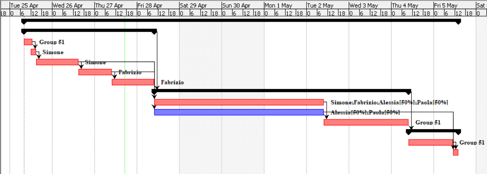

# Project Estimation - FUTURE
Date: 27/04/2023

Version: 1.1

# Estimation approach
Consider the EZWallet  project in FUTURE version (as proposed by the team), assume that you are going to develop the project INDEPENDENT of the deadlines of the course
# Estimate by size
### 
|             | Estimate                        |             
| ----------- | ------------------------------- |  
| NC =  Estimated number of classes to be developed    |    18  (assuming js + frontend modules)          |             
|  A = Estimated average size per class, in LOC       |      85 LOC                  | 
| S = Estimated size of project, in LOC (= NC * A) | 1500 LOC|
| E = Estimated effort, in person hours (here use productivity 10 LOC per person hour)  |  150   
| C = Estimated cost, in euro (here use 1 person hour cost = 30 euro) | 2700 | 
 | Estimated calendar time, in calendar weeks (Assume team of 4 people, 8 hours per day, 5 days per week ) |           ~5 days         |               

# Estimate by product decomposition

Assuming an average of 10 LOC per person hours for every module in the coding part
### 
|         component name    | Estimated effort (person hours)   |             
| ----------- | ------------------------------- | 
|requirement document    | 22 |
| GUI prototype | 16 |
|design document | 5 |
|code | 110 |
| unit tests | 20 |
| api tests | 15 |
| management documents  | 5 |

# Estimate by activity decomposition

Assuming an average of 10 LOC per person hour in coding and testing cases, unit testing includes GUI testing
### 
|         Activity name    | Estimated effort (person hours)   |             
| ----------- | ------------------------------- | 
| define F/NF Requirement | 6|
| indentify Actor and Stakeholders | 2 |
| define Use Case and Scenarios | 8 |
| System Design and Design Document| 8 |
| UML Diagrams and Management Document | 8 |
| Coding | 110|
| GUI prototype |16 |
| API/Unit testing |35|
| Final Review | 6 |
###

# Summary

The duration is calculated considering a team of 4 people that work 8 hs a day for 5 days per week

|             | Estimated effort (person hours)                        |   Estimated duration (days)  |          
| ----------- | ------------------------------- | ---------------|
| estimate by size | 150 | 5 |
| estimate by product decomposition | 193 | 6 |
| estimate by activity decomposition | 199 | 6 |

The differences between the various types of estimations lay on the fact that:

-Estimation by size refers to the raw size of the application code developed in order to fullfill the fuctional requirements

-Estimation by product decomposition also comprend the development and management document and is an overall sum of the work hours needed

-Estimation by activity decomposition refers to the same elements of the the one "by product decomposition" plus the final review by the the team, but includes also the presence of contraints related to the activities that are predecessors of others, it also includes the benefits of parallelization of some activites made possible by task distribution between the team members.

