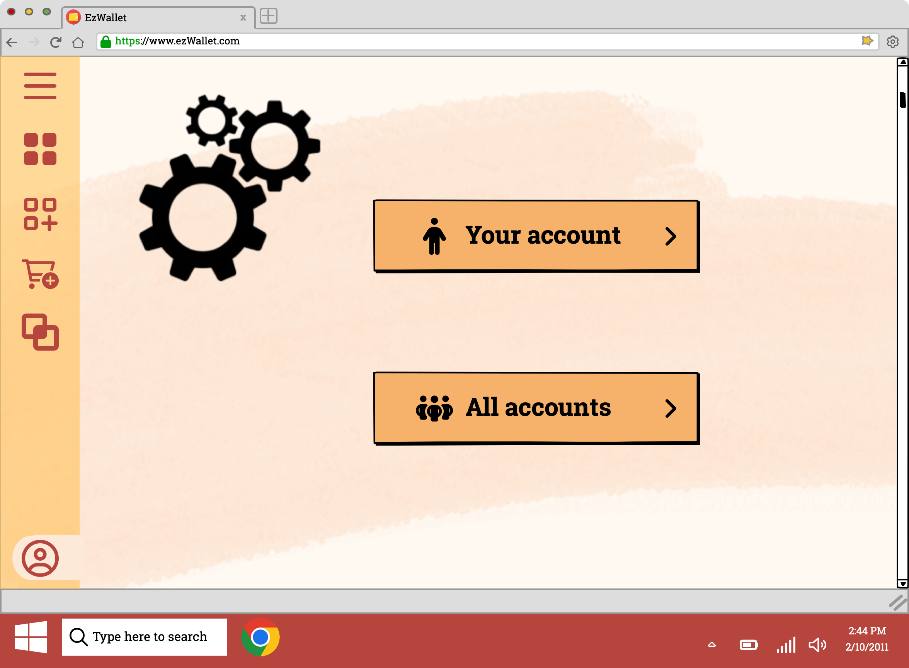

# Graphical User Interface Prototype  - CURRENT

Authors: Group 51

Date: 26/04/2023

Version: V1 - description of EZWallet GUI in CURRENT form (as received by teachers)

# GUI V1

## Use case 1, UC1: Sign Up
#

* Scenario 1.1 Successful sign up

* Scenario 1.2 Inserted Email already exists

## Use case 2, UC2: Log In
#

* Scenario 2.1 Successful log in

* Scenario 2.2 Unsuccessful log in (User not registered)

* Scenario 2.3 Unsuccessful log in (Wrong credentials)

* Scenario 2.4 Log in erorr (User already logged)

## Use case 3, UC3: Log Out
#
* Scenario 3.1 Log Out

## Use case 4, UC4: Create Transaction
#

* Scenario 4.1 Create Transaction

## Use case 5, UC5: Display Transactions
#
* Scenario 5.1 Display Transactions

## Use case 6, UC6: Delete Transaction
#
* Scenario 6.1 Delete Transaction

## Use case 7, UC7: Create Category
#

## Use case 8, UC8: Display Categories
#
* Scenario 8.1 Display Categories

## Use case 9, UC9: Display Transaction Labels
#
* Scenario 9.1 Display Transactions labels

## Use case 10, UC10: Show profile information
#

* Scenario 10.1 Show information

## Use case 11, UC11: List all users
#

* Scenario 11.1 Show all users

