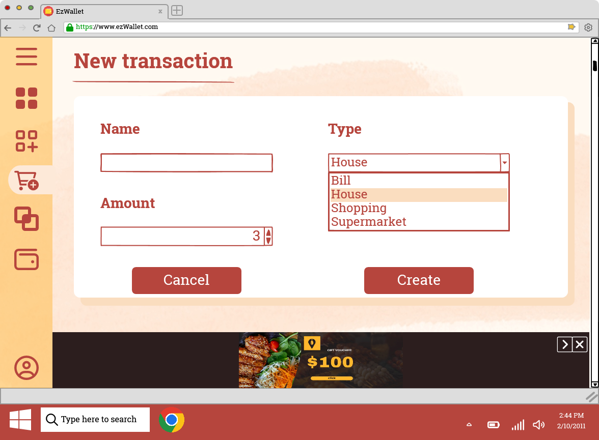
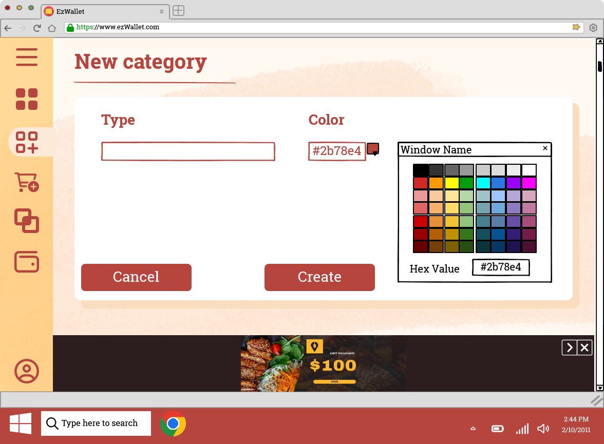

# Graphical User Interface Prototype  - FUTURE

Authors: Group 51

Date: 26/04/2023

Version: V2 - description of EZWallet in FUTURE form (as proposed by the team)

# GUI V2

## Use case 1, UC1: Sign Up
#

* Scenario 1.1 Successful sign up

* Scenario 1.2 Inserted Email already exists

## Use case 2, UC2: Log In
#

* Scenario 2.1 Successful log in

* Scenario 2.2 Unsuccessful log in (User not registered)

* Scenario 2.3 Unsuccessful log in (Wrong credentials)

## Use case 3, UC3: Log Out
#
* Scenario 3.1 Log Out

## Use case 4, UC4: Create Transaction
#

* Scenario 4.1 Create Transaction

* Scenario 4.2 Create Transaction without inserting data

## Use case 5, UC5: Display Transactions
#
* Scenario 5.1 Display Transactions

## Use case 6, UC6: Display Transaction Labels
#
* Scenario 6.1 	Display Transactions Labels

## Use case 7, UC7: Display Transactions by period of time
#
* Scenario 7.1 Display Transactions by period of time

## Use case 8, UC8: Display Transactions per category
#
* Scenario 8.1 Display Transactions per category

## Use case 9, UC9: Delete Transaction
#

* Scenario 9.1 Successful Delete Transaction

* Scenario 9.2 Unccessful Delete Transaction

## Use case 10, UC10: Create Category
#

* Scenario 10.1 Successful Create Category

* Scenario 10.2 Unsuccessful Create Category

## Use case 11, UC11: Display Categories
#
* Scenario 11.1 Display Categories

## Use case 12, UC12: Delete Category
#

* Scenario 12.1 Successful Delete Category

* Scenario 12.2 Unccessful Delete Category

## Use case 13, UC13: Show profile information
#
* Scenario 13.1 Show information

## Use case 14, UC14: List all users
#
* Scenario 14.1 Show all users

## Use case 15, UC15: Create Wallet
#

* Scenario 15.1 Successful Create Wallet

* Scenario 15.2 Unsuccessful Create Wallet

* Scenario 15.3 Join an existing group wallet

* Scenario 15.4 	Share the wallet

## Use case 16, UC16: Insert Budget
#

* Scenario 16.1 Insert Budget

* Scenario 16.2 User does not want to insert a budget

## Use case 17, UC17: Update Budget
#
* Scenario 17.1 Update Budget (Creation of transaction)

|Before|After|
| ------------- |:-------------| 
|  |  |

* Scenario 17.2 Budget terminates

* Scenario 17.3 Update Budget (Deletion of transaction)

|Before|After|
| ------------- |:-------------| 
|  |  |

## Use case 18, UC18: Join Wallet
#

* Scenario 18.1 Successful Join Wallet

* Scenario 18.2  Unsuccessful Join Wallet

## Use case 19, UC19: Share Wallet
#
* Scenario 19.1 Share Wallet

## Use case 20, UC20: Delete Wallet
#

* Scenario 20.1 Successful Delete Wallet

* Scenario 20.2 Unsuccessful Delete Wallet

## Use case 21, UC21: Display all Wallet
#
* Scenario 21.1 Display Wallet

## Use case 22, UC22: Display all users of shared wallet
#
* Scenario 22.1 Display Users of shared wallet

## Use case 23, UC23: Manage Ads
#
* Scenario 23.1 Manage Ads

