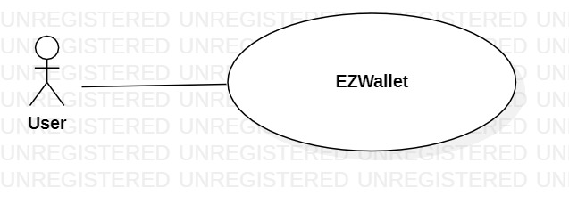
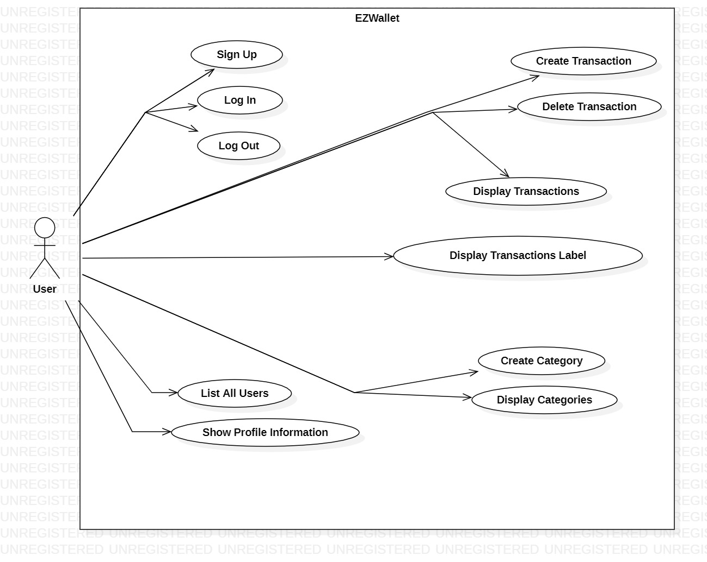
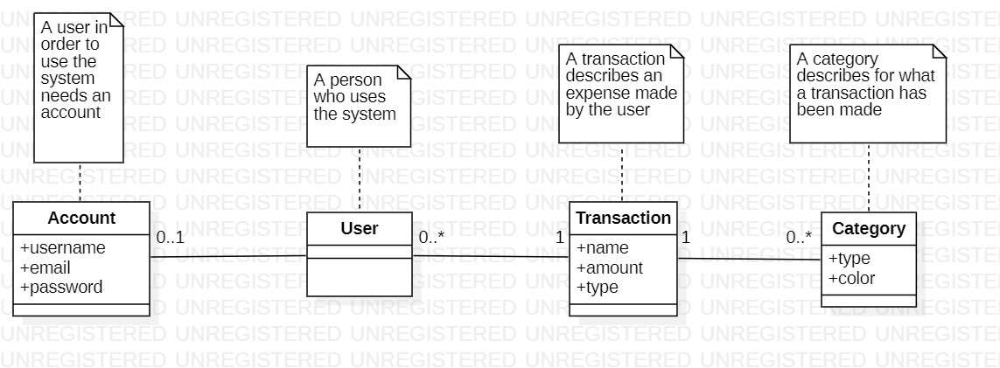
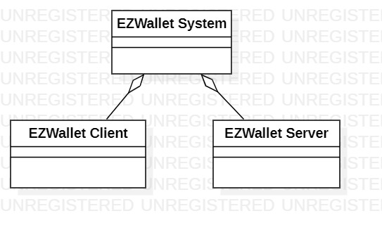
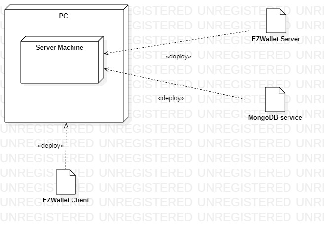

# Requirements Document - current EZWallet

Date: 26/04/2023

Version: V1 - description of EZWallet in CURRENT form (as received by teachers)

 
| Version number | Change |
| ----------------- |:-----------|
| 0.1 | Added stakeholders, stories and personas, FR and NFR | 
| 0.2 | Added use cases with their scenarios | 
| 0.3 | Update of UC | 

# Contents

- [Informal description](#informal-description)
- [Stakeholders](#stakeholders)
- [Context Diagram and interfaces](#context-diagram-and-interfaces)
	+ [Context Diagram](#context-diagram)
	+ [Interfaces](#interfaces) 
	
- [Stories and personas](#stories-and-personas)
- [Functional and non functional requirements](#functional-and-non-functional-requirements)
	+ [Functional Requirements](#functional-requirements)
	+ [Non functional requirements](#non-functional-requirements)
- [Use case diagram and use cases](#use-case-diagram-and-use-cases)
	+ [Use case diagram](#use-case-diagram)
	+ [Use cases](#use-cases)
    	+ [Relevant scenarios](#relevant-scenarios)
- [Glossary](#glossary)
- [System design](#system-design)
- [Deployment diagram](#deployment-diagram)

# Informal description
EZWallet (read EaSy Wallet) is a software application designed to help individuals and families keep track of their expenses. Users can enter and categorize their expenses, allowing them to quickly see where their money is going. EZWallet is a powerful tool for those looking to take control of their finances and make informed decisions about their spending.

# Stakeholders

| Stakeholder name  | Description | 
| ----------------- |:-----------|
|   Users    |       People who use the software      | 

# Context Diagram and interfaces

## Context Diagram

## Interfaces

| Actor | Logical Interface | Physical Interface  |
| ------------- |:-------------:| -----:|
|   User     | GUI  |  PC |

# Stories and personas

* Persona 1: male, married, with children, age 52
	* Story 1: he noticed a lot of expenses in the last month and he wants to investigate on how his money are spent and categorize it.
* Persona 2: off-site student, age 22
	* Story 2: she has a limited budget so she needs to track his expenses in order to save money.

# Functional and non functional requirements

## Functional Requirements

| ID        | Description  |
| ------------- |:-------------| 
|  FR1     	| Manage Account |
|  FR1.1    | Define a new account |
|  FR1.2    | Log in |
|  FR1.3    | Log out |
|  F2     	| Manage Transaction  |
|  F2.1     | Create a new transaction |
|  F2.2     | Delete an existing transaction |
|  F2.3     | Display all existing transactions |
|  F2.4     | Display transactions with Label |
|  F3     	| Manage Categories  |
|  F3.1     | Create a new category |
|  F3.2     | Display all existing categories |
|  F4     	| Manage Users |
|  F4.1     | Display information about the user |
|  F4.2     | Display all the users |

## Non Functional Requirements

| ID        | Type (efficiency, reliability, ..)           | Description  | Refers to |
| ------------- |:-------------| :-----| -----:|
|  NFR1     |  Usability | Application should be easily usable for untrained users | All FR |
|  NFR2     | Performance | All functions should terminate in < 0.5 sec | All FR |
|  NFR3     | Availability | Max Server downtime  1h/ year| All FR|
| NFR4 | Security | Password should be stored encrypted in the DB  | FR1.1| 
| NFR5 | Domain | Session expires after 1 hour of inactivity  | All FR| 
| NFR6 | Domain | Email must be unique | FR1.1| 

# Use case diagram and use cases

## Use case diagram

### Use case 1, UC1: Sign Up
| Actors Involved        | User |
| ------------- |:-------------| 
|  Precondition     | The user does not have an account already |
|  Post condition     | The user has created an account |
|  Nominal Scenario     | The user inserts the credentials asked by the application and the account is created |
|  Variants     | None |
|  Exceptions     | Account name is taken or password does not satisfy rules |

| Scenario 1.1 | Successful sign up |
| ------------- |:-------------| 
|  Precondition     | User does not have an account already  |
|  Post condition     | User creates an account successfully |
| Step#        | Description  |
|  1     | User asks to sign up |  
|  2     | Application asks for his username and email |
|  3     | User inserts his username and email |
|  4     | Application checks that email is available, email is available |
|  5     | Application asks for password |
|  6     | User inserts his password |
|  7     | Application stores the account and shows a confirm message |

| Scenario 1.2 | Inserted Email already exists |
| ------------- |:-------------| 
|  Precondition     | Email has been stored in the application already  |
|  Post condition     | None |
| Step#        | Description  |
|  1     | User asks to sign up |  
|  2     | Application asks for his username and email |
|  3     | User inserts his username and email |
|  4     | Application checks that email is available, email is not available |
|  5     | Application shows a message saying the user is already registered |

### Use case 2, UC2: Log In
| Actors Involved        | User |
| ------------- |:-------------| 
|  Precondition     | The user has an account already |
|  Post condition     | The user is logged into the application|
|  Nominal Scenario     | The user inserts the credentials and has access to the application |
|  Variants     | None |
|  Exceptions     | Credentials are not valid or the user is not registered |

| Scenario 2.1 | Successful log in |
| ------------- |:-------------| 
|  Precondition     | User has an account already  |
|  Post condition     | User is logged into the application|
| Step#        | Description  |
|  1     | User asks to log in |  
|  2     | Application asks for his email and password |
|  3     | User inserts his email and password |
|  4     | Application checks that email exists, email exists |
|  5     | Application check if the password is correct, password is correct |
|  6     | User is logged|

| Scenario 2.2 | Unsuccessful log in (User not registered)|
| ------------- |:-------------| 
|  Precondition     | User does not have an account already  |
|  Post condition     | User is not logged into the application |
| Step#        | Description  |
|  1     | User asks to log in |  
|  2     | Application asks for his email and password |
|  3     | User inserts his email and password |
|  4     | Application checks that email exists, email does not exists |
|  5     | Application shows an error message saying that the user is not registered |

| Scenario 2.3 | Unsuccessful log in (Wrong credentials)|
| ------------- |:-------------| 
|  Precondition     | User does not have an account already  |
|  Post condition     | User is not logged into the application |
| Step#        | Description  |
|  1     | User asks to log in |  
|  2     | Application asks for his email and password |
|  3     | User inserts his email and password |
|  4     | Application checks that email exists, email exists |
|  5     | Application check if the password is correct, password is not correct |
|  6     | Application shows an error message saying that the credentials are wrong|

| Scenario 2.4 | Log in error (User already logged in)|
| ------------- |:-------------| 
|  Precondition     | User is logged into his account  |
|  Post condition     | None |
| Step#        | Description  |
|  1     | User asks to log in |  
|  2    | Application shows a message saying that the user is already logged in |  

### Use case 3, UC3: Log Out
| Actors Involved        | User |
| ------------- |:-------------| 
|  Precondition     | The user is logged into his account|
|  Post condition     | The user is logged out from the application|
|  Nominal Scenario     | The user asks for logout |
|  Variants     | User closes the browser without asking explicity to log out |
|  Exceptions     | None |

| Scenario 3.1 | Log Out |
| ------------- |:-------------| 
|  Precondition     | User is logged into the application  |
|  Post condition     | User is logged out from the application|
| Step#        | Description  |
|  1     | User asks to log out or close the browser |  
|  2     | Application logs out the user from the application |

### Use case 4, UC4: Create Transaction
| Actors Involved        | User |
| ------------- |:-------------| 
|  Precondition     | The user is logged into his account|
|  Post condition     | The transaction is created |
|  Nominal Scenario     | The user asks to create a new transaction, application asks for data of the transaction and the transaction is stored in the application |
|  Variants     | User closes the browser without asking explicity to log out |
|  Exceptions     | None |

| Scenario 4.1 | Create Transaction |
| ------------- |:-------------| 
|  Precondition     | User is logged into the application  |
|  Post condition     | Transaction is created |
| Step#        | Description  |
|  1     | User asks to create a new transaction |  
|  2     | Application asks for a name, the amount and the type of the transaction |
|  3     | User inserts the requested data |
|  4     | Application creates a new transaction with the data inserted and saves also the timestamp |

| Scenario 4.2 | Create Transaction without inserting data|
| ------------- |:-------------| 
|  Precondition     | User is logged into the application  |
|  Post condition     | Transaction is created |
| Step#        | Description  |
|  1     | User asks to create a new transaction |  
|  2     | Application asks for a name, the amount and the type of the transaction |
|  3     | User does not insert data |
|  4     | Application creates a new transaction with default values and saves also the timestamp |

### Use case 5, UC5: Display Transactions
| Actors Involved        | User  |
| ------------- |:-------------| 
|  Precondition     | The user is logged into his account|
|  Post condition     | The transactions are displayed |
|  Nominal Scenario     | The user asks the application to show all transactions made |
|  Variants     | None |
|  Exceptions     | None |

| Scenario 5.1 | Display Transactions |
| ------------- |:-------------| 
|  Precondition     | User is logged into the application  |
|  Post condition     | Transactions are displayed |
| Step#        | Description  |
|  1     | User asks to get all the transactions |  
|  2     | Application retrieves all the transactions and displays them to the user |

### Use case 6, UC6: Delete Transaction
| Actors Involved        | User |
| ------------- |:-------------| 
|  Precondition     | The user is logged into his account and the transaction exists|
|  Post condition     | The transaction is deleted from the system |
|  Nominal Scenario     | The user asks to delete one transaction |
|  Variants     | None |
|  Exceptions     | None |

| Scenario 6.1 | Delete Transaction |
| ------------- |:-------------| 
|  Precondition     | User is logged into the application and the transaction exists |
|  Post condition     | Transaction is deleted from the application |
| Step#        | Description  |
|  1     | User asks to delete a transaction |  
|  2     | Application retrieves the transaction and delete it |

### Use case 7, UC7: Create Category
| Actors Involved        | User |
| ------------- |:-------------| 
|  Precondition     | The user is logged into his account|
|  Post condition     | The category is created |
|  Nominal Scenario     | The user asks to create a new category, application asks for data of the category and the category is stored in the application |
|  Variants     | None |
|  Exceptions     | The user does not insert the data |

| Scenario 7.1 | Successful Create Category |
| ------------- |:-------------| 
|  Precondition     | User is logged into the application  |
|  Post condition     | Category is created |
| Step#        | Description  |
|  1     | User asks to create a new category |  
|  2     | Application asks for the type and the color of the category |
|  3     | User inserts the requested data |
|  4     | Application creates a new category with the data inserted by the user |

| Scenario 7.2 | Unsuccessful Create Category |
| ------------- |:-------------| 
|  Precondition     | User is logged into the application  |
|  Post condition     | Category is not created |
| Step#        | Description  |
|  1     | User asks to create a new category |  
|  2     | Application asks for the type and the color of the category |
|  3     | User does not insert data |
|  4     | Application does not create the category |

### Use case 8, UC8: Display Categories
| Actors Involved        | User |
| ------------- |:-------------| 
|  Precondition     | The user is logged into his account|
|  Post condition     | The categories are displayed |
|  Nominal Scenario     | The user asks the application to show all categories in the application |
|  Variants     | None |
|  Exceptions     | None |

| Scenario 8.1 | Display Categories |
| ------------- |:-------------| 
|  Precondition     | User is logged into the application  |
|  Post condition     | Categories are displayed |
| Step#        | Description  |
|  1     | User asks to get all the categories |  
|  2     | Application retrieves all the categories and displays them to the user |

### Use case 9, UC9: Display Transaction Labels
| Actors Involved        | User  |
| ------------- |:-------------| 
|  Precondition     | The user is logged into his account|
|  Post condition     | Transactions are displayed with their relative Label |
|  Nominal Scenario     | The user asks the application to display all the transactions with the color type associated|
|  Variants     | None |
|  Exceptions     | None |

| Scenario 9.1 | Display Transactions labels |
| ------------- |:-------------| 
|  Precondition     | User is logged into the application  |
|  Post condition     | Transactions are displayed with their  Label |
| Step#        | Description  |
|  1     | User asks to get all the transactions with their label |   
|  2     | Application retrieves all the transaction and displays them to the user showing also their type and color  |

### Use case 10, UC10: Show profile information
| Actors Involved        | User |
| ------------- |:-------------| 
|  Precondition     | The user is logged into his account|
|  Post condition     | User information are displayed |
|  Nominal Scenario     | The user asks the application to show all informations about their account |
|  Variants     | None |
|  Exceptions     | None |

| Scenario 10.1 | Show information |
| ------------- |:-------------| 
|  Precondition     | User is logged into the application  |
|  Post condition     | Account information are displayed |
| Step#        | Description  |
|  1     | User asks to get all the information about his account |  
|  2     | Application retrieves all the informations and displays them to the user |

### Use case 11, UC11: List all users
| Actors Involved        | User |
| ------------- |:-------------| 
|  Precondition     | The user is logged into his account |
|  Post condition     | All users informations are displayed |
|  Nominal Scenario     | The user asks the application to show all informations about their account, the application retrieves the information and shows them  |
|  Variants     | None |
|  Exceptions     | None |

| Scenario 11.1 | Show all users |
| ------------- |:-------------| 
|  Precondition     | User is logged into the application  |
|  Post condition     | Account information are displayed |
| Step#        | Description  |
|  1     | User asks to get all the information about all the user registered to the application |  
|  2     | Application retrieves all the users and displays their informations |

# Glossary

# System Design

# Deployment Diagram 
The software is freely available on a repository on GitHub, it runs locally on the User PC using MongoDB services.

# Defect table

| #        | Defect         | 
| ------------- |:----------| 
|  1     |  The method Get User return all the user in the application to anyone who call it| 
|  2     |  There is no authorization control to differentiate between user and admin| 
|  3     |  Get Label does not return the color of the transaction| 
|  4     |  The method Get Transaction return all users' transaction to anyone who call it because in this version transactions are not associated with the user. | 