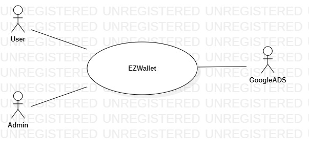
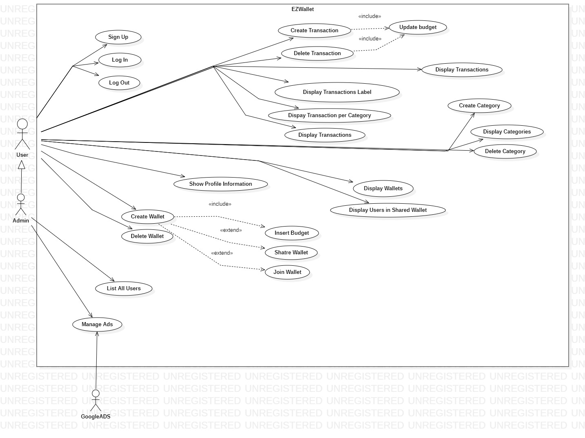
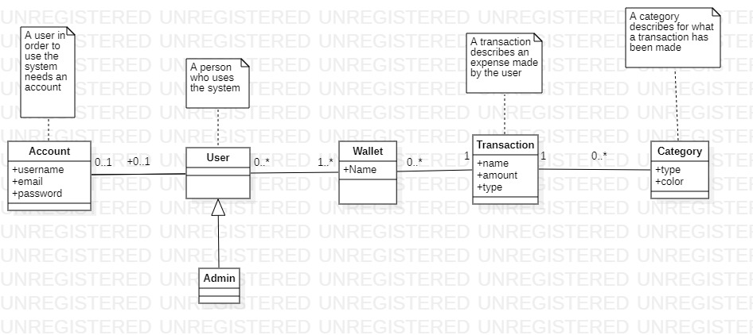
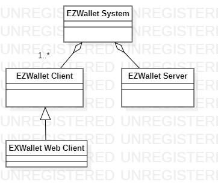
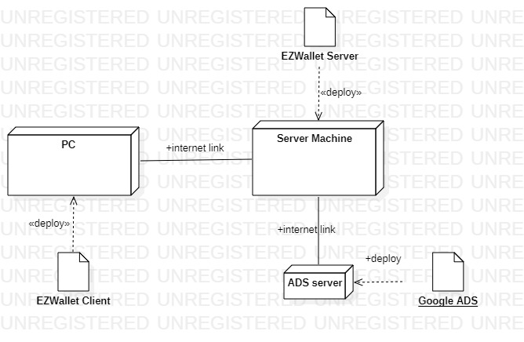

# Requirements Document - future EZWallet

Date: 26/04/2023

Version: V2 - description of EZWallet in FUTURE form (as proposed by the team)

 
| Version number | Change |
| ----------------- |:-----------|
| 0.1|Added stakeholders, stories, UC and scenarios | 

# Contents

- [Informal description](#informal-description)
- [Stakeholders](#stakeholders)
- [Context Diagram and interfaces](#context-diagram-and-interfaces)
	+ [Context Diagram](#context-diagram)
	+ [Interfaces](#interfaces) 
	
- [Stories and personas](#stories-and-personas)
- [Functional and non functional requirements](#functional-and-non-functional-requirements)
	+ [Functional Requirements](#functional-requirements)
	+ [Non functional requirements](#non-functional-requirements)
- [Use case diagram and use cases](#use-case-diagram-and-use-cases)
	+ [Use case diagram](#use-case-diagram)
	+ [Use cases](#use-cases)
    	+ [Relevant scenarios](#relevant-scenarios)
- [Glossary](#glossary)
- [System design](#system-design)
- [Deployment diagram](#deployment-diagram)

# Informal description
EZWallet (read EaSy Wallet) is a software application designed to help individuals and families keep track of their expenses. Users can enter and categorize their expenses, allowing them to quickly see where their money is going. EZWallet is a powerful tool for those looking to take control of their finances and make informed decisions about their spending.

# Stakeholders

| Stakeholder name  | Description | 
| ----------------- |:-----------|
|   Users    |       People who use the software      |
|   Admin    |       User with admin privileges     | 
|   Google Ads    |       Company who manage the ads in the application      | 

# Context Diagram and interfaces

## Context Diagram

## Interfaces

| Actor | Logical Interface | Physical Interface  |
| ------------- |:-------------|:-----|
|   User     | GUI  |  PC |
|   Admin     | GUI  |  PC |
| Google Ads | Internet Link | https://developers.google.com/google-ads/api/docs/start |

# Stories and personas

* Persona 1: male, married, with children, age 52
	* Story 1: he noticed a lot of expenses in the last month and he wants to investigate on how his money are spent and categorize them.
* Persona 2: off-site student, age 22
	* Story 2: she has a limited budget so she needs to track his expenses in order to save money.
* Persona 3: admin, age 30
	* Story 3: he has the possibility to see all the person subscribed to the application. 
* Persona 4: room mates, different ages
	* Story 3: they can share the wallet to keep track of their expenses in the house and respect their budget.
* Persona 5: female, worker, age 27
	* Story 3: she works but she is not able to manage her money, so decide to use the application to set a budget for her monthly expenses and try to respect it to save money.

# Functional and non functional requirements

## Functional Requirements

| ID        | Description  |
| ------------- |:-------------| 
|  FR1     	| Manage Account |
|  FR1.1    | Define a new account |
|  FR1.2    | Log in |
|  FR1.3    | Log out |
|  F2     	| Manage Transactions  |
|  F2.1     | Create a new transaction |
|  F2.2     | Delete an existing transaction |
|  F2.3     | Display all existing transactions |
|  F2.4     | Display transactions labels |
|  F2.5     | Display transactions by period of time |
|  F2.6     | Display transaction per category |
|  F3     	| Manage Categories  |
|  F3.1     | Create a new category |
|  F3.2     | Display all existing categories |
|  F3.3     | Delete category |
|  F4     	| Manage Users |
|  F4.1     | Display information about the user |
|  F4.2     | Display all the users |
|  F5     	| Manage Wallet |
|  F5.1     | Create new wallet |
|  F5.2     | Share link of the wallet|
|  F5.3     | Insert link of an existing wallet|
|  F5.4     | Insert monthly budget of the wallet|
|  F5.5     | Update budget of the wallet|
|  F5.6     | Delete wallet|
|  F5.7     | Display wallet|
|  F5.8     | Display users of shared wallet|
|  F6     	| Manage Ads |
|  F6.1     | Show Ads in the application|

## Non Functional Requirements

| ID        | Type (efficiency, reliability, ..)           | Description  | Refers to |
| ------------- |:-------------| :-----| -----:|
|  NFR1     |  Usability | Application should be easily usable for untrained users | All FR |
|  NFR2     | Performance | All functions should terminate in < 0.5 sec | All FR |
|  NFR3     | Availability | Max Server downtime  1h/ year| All FR|
| NFR4 | Security | Password should be stored encrypted in the DB  | FR1.1| 
| NFR5 | Domain | Session expires after 1 hour of inactivity  | All FR| 
| NFR6 | Domain | Email must be unique | FR1.1| 
| NFR7 | Domain | Name of the wallet must be unique | FR5.1| 

# Use case diagram and use cases

## Use case diagram

### Use case 1, UC1: Sign Up
| Actors Involved        | User |
| ------------- |:-------------| 
|  Precondition     | The user does not have an account already |
|  Post condition     | The user has created an account |
|  Nominal Scenario     | The user inserts the credentials asked by the application and the account is created |
|  Variants     | None |
|  Exceptions     | Account name is taken or password  |

| Scenario 1.1 | Successful sign up |
| ------------- |:-------------| 
|  Precondition     | User does not have an account already  |
|  Post condition     | User creates an account successfully |
| Step#        | Description  |
|  1     | User asks to sign up |  
|  2     | Application asks for his username and email |
|  3     | User inserts his username and email |
|  4     | Application checks that email is available, email is available |
|  5     | Application asks for password |
|  6     | User inserts his password |
|  7     | Application stores the account and shows a confirm message |

| Scenario 1.2 | Inserted Email already exists |
| ------------- |:-------------| 
|  Precondition     | Email has been stored in the application already  |
|  Post condition     |  |
| Step#        | Description  |
|  1     | User asks to sign up |  
|  2     | Application asks for his username and email |
|  3     | User inserts his username and email |
|  4     | Application checks that email is available, email is not available |
|  5     | Application shows a message saying the user is already registered |

### Use case 2, UC2: Log In
| Actors Involved        | User |
| ------------- |:-------------| 
|  Precondition     | The user has an account already |
|  Post condition     | The user is logged into the application|
|  Nominal Scenario     | The user inserts the credentials and has access to the application |
|  Variants     | None |
|  Exceptions     | Credentials are not valid or the user is not registered |

| Scenario 2.1 | Successful log in |
| ------------- |:-------------| 
|  Precondition     | User has an account already  |
|  Post condition     | User is logged into the application|
| Step#        | Description  |
|  1     | User asks to log in |  
|  2     | Application asks for his email and password |
|  3     | User inserts his email and password |
|  4     | Application checks that email exists, email exists |
|  5     | Application check if the password is correct, password is correct |
|  6     | User is logged into his account|

| Scenario 2.2 | Unsuccessful log in (User not registered)|
| ------------- |:-------------| 
|  Precondition     | User does not have an account already  |
|  Post condition     | User is not logged into the application |
| Step#        | Description  |
|  1     | User asks to log in |  
|  2     | Application asks for his email and password |
|  3     | User inserts his email and password |
|  4     | Application checks that email exists, email does not exists |
|  5     | Application shows an error message saying that the user is not registered |

| Scenario 2.3 | Unsuccessful log in (Wrong password)|
| ------------- |:-------------| 
|  Precondition     | User does not have an account already  |
|  Post condition     | User is not logged into the application |
| Step#        | Description  |
|  1     | User asks to log in |  
|  2     | Application asks for his email and password |
|  3     | User inserts his email and password |
|  4     | Application checks that email exists, email exists |
|  5     | Application check if the password is correct, password is not correct |
|  6     | Application shows an error message saying that the credentials are wrong|

### Use case 3, UC3: Log Out
| Actors Involved        | User |
| ------------- |:-------------| 
|  Precondition     | The user is logged into his account|
|  Post condition     | The user is logged out from the application|
|  Nominal Scenario     | The user asks for logout |
|  Variants     | User closes the browser without asking explicity to log out |
|  Exceptions     | None |

| Scenario 3.1 | Log Out |
| ------------- |:-------------| 
|  Precondition     | User is logged into the application  |
|  Post condition     | User is logged out from the application|
| Step#        | Description  |
|  1     | User asks to log out or close the browser |  
|  2     | Application logs out the user from the application |

### Use case 4, UC4: Create Transaction
| Actors Involved        | User |
| ------------- |:-------------| 
|  Precondition     | The user is logged into his account|
|  Post condition     | The transaction is created |
|  Nominal Scenario     | The user asks to create a new transaction, application asks for data of the transaction and the transaction is stored in the application and the budget is updated |
|  Variants     | User closes the browser without asking explicity to log out |
|  Exceptions     | None |

| Scenario 4.1 | Create Transaction |
| ------------- |:-------------| 
|  Precondition     | User is logged into the application  |
|  Post condition     | Transaction is created |
| Step#        | Description  |
|  1     | User asks to create a new transaction |  
|  2     | Application asks for a name, the amount and the type of the transaction |
|  3     | User inserts the requested data |
|  4     | Application creates a new transaction with the data inserted and saves also the timestamp |
|  5     | Include Point of UC17 (Update Budget)|

| Scenario 4.2 | Create Transaction without inserting data|
| ------------- |:-------------| 
|  Precondition     | User is logged into the application  |
|  Post condition     | Transaction is created |
| Step#        | Description  |
|  1     | User asks to create a new transaction |  
|  2     | Application asks for a name, the amount and the type of the transaction |
|  3     | User does not insert data |
|  4     | Application creates a new transaction with default values and saves also the timestamp |
|  5     | Include Point of UC17 (Update Budget)|

### Use case 5, UC5: Display Transactions
| Actors Involved        | User  |
| ------------- |:-------------| 
|  Precondition     | The user is logged into his account|
|  Post condition     | The transactions are displayed |
|  Nominal Scenario     | The user asks the application to show all transaction made |
|  Variants     | None |
|  Exceptions     | None |

| Scenario 5.1 | Display Transactions |
| ------------- |:-------------| 
|  Precondition     | User is logged into the application  |
|  Post condition     | Transactions are displayed |
| Step#        | Description  |
|  1     | User asks to get all the transactions |  
|  2     | Application retrieves all the transactions and displays them to the user |

### Use case 6, UC6: Display Transaction Labels
| Actors Involved        | User  |
| ------------- |:-------------| 
|  Precondition     | The user is logged into his account|
|  Post condition     | Transactions are displayed with their relative Label |
|  Nominal Scenario     | The user asks the application to display all the transactions with their color and type|
|  Variants     | None |
|  Exceptions     | None |

| Scenario 6.1 | Display Transactions Labels |
| ------------- |:-------------| 
|  Precondition     | User is logged into the application  |
|  Post condition     | Transactions are displayed with their relative Label |
| Step#        | Description  |
|  1     | User asks to get all the transactions with their label |  
|  2     | Application retrieves all the transactions and displays them to the user showing also their type and color |

### Use case 7, UC7: Display Transactions by period of time
| Actors Involved        | User  |
| ------------- |:-------------| 
|  Precondition     | The user is logged into his account |
|  Post condition     | Transactions are displayed for the period of time chosen by the user |
|  Nominal Scenario     | The user asks to the application to show the transactions made in a certain period of time|
|  Variants     | None |
|  Exceptions     | None |

| Scenario 7.1 | Display Transactions by period of time  |
| ------------- |:-------------| 
|  Precondition     | User is logged into the application  |
|  Post condition     | Transactions are displayed for the period of time chosen by the user |
| Step#        | Description  |
|  1     | User asks to get all the transactions for the period of time he has chosen |  
|  2     | Application retrieves all the transaction and displays them |

### Use case 8, UC8: Display Transactions per category
| Actors Involved        | User  |
| ------------- |:-------------| 
|  Precondition     | The user is logged into his account |
|  Post condition     | Transactions are displayed for the category chosen by the user|
|  Nominal Scenario     | The user asks to the application to show the transactions made for a certain category|
|  Variants     | None |
|  Exceptions     | None |

| Scenario 8.1 | Display Transactions per category  |
| ------------- |:-------------| 
|  Precondition     | User is logged into the application  |
|  Post condition     | Transactions are displayed for the category chosen by the user |
| Step#        | Description  |
|  1     | User asks to get all the transactions for the category he has chosen |  
|  2     | Application retrieves all the transaction and displays them |

### Use case 9, UC9: Delete Transaction
| Actors Involved        | User |
| ------------- |:-------------| 
|  Precondition     | The user is logged into his account and the transaction exists|
|  Post condition     | The transaction is deleted from the application and the budget is updated |
|  Nominal Scenario     | The user asks to delete one transaction |
|  Variants     | None |
|  Exceptions     | None |

| Scenario 9.1 | Successful Delete Transaction |
| ------------- |:-------------| 
|  Precondition     | User is logged into the application and the transaction exists |
|  Post condition     | Transaction is deleted from the application |
| Step#        | Description  |
|  1     | User asks to delete a transaction | 
|  2     | Application asks if the user is sure to delete the selected transactions, the user is sure  | 
|  3     | Application retrieves the transaction and delete it |
|  4     | Include Point of UC17 (Update Budget)|

| Scenario 9.2 | Unccessful Delete Transaction |
| ------------- |:-------------| 
|  Precondition     | User is logged into the application and the transaction exists |
|  Post condition     | None |
| Step#        | Description  |
|  1     | User asks to delete a transaction | 
|  2     | Application asks if the user is sure to delete the selected transactions, the user is not sure  | 
|  3     | Application does not delete the transaction |

### Use case 10, UC10: Create Category
| Actors Involved        | User |
| ------------- |:-------------| 
|  Precondition     | The user is logged into his account|
|  Post condition     | The category is created |
|  Nominal Scenario     | The user asks to create a new category, application asks for data of the category and the category is stored in the application |
|  Variants     | None |
|  Exceptions     | The user does not insert the data |

| Scenario 10.1 | Successful Create Category |
| ------------- |:-------------| 
|  Precondition     | User is logged into the application  |
|  Post condition     | Category is created |
| Step#        | Description  |
|  1     | User asks to create a new category |  
|  2     | Application asks for the type and the color of the category |
|  3     | User inserts the requested data |
|  4     | Application creates a new category with the data inserted by the user |

| Scenario 10.2 | Unsuccessful Create Category |
| ------------- |:-------------| 
|  Precondition     | User is logged into the application  |
|  Post condition     | Category is not created |
| Step#        | Description  |
|  1     | User asks to create a new category |  
|  2     | Application asks for the type and the color of the category |
|  3     | User does not insert data |
|  4     | Application does not create the category |

### Use case 11, UC11: Display Categories
| Actors Involved        | User |
| ------------- |:-------------| 
|  Precondition     | The user is logged into his account|
|  Post condition     | The categories are displayed |
|  Nominal Scenario     | The user asks the application to show all categories in the application |
|  Variants     | None |
|  Exceptions     | None |

| Scenario 11.1 | Display Categories |
| ------------- |:-------------| 
|  Precondition     | User is logged into the application  |
|  Post condition     | Categories are displayed |
| Step#        | Description  |
|  1     | User asks to get all the categories |  
|  2     | Application retrieves all the categories and displays them to the user |

### Use case 12, UC12: Delete Category
| Actors Involved        | User |
| ------------- |:-------------| 
|  Precondition     | The user is logged into his account|
|  Post condition     | The selected category is deleted |
|  Nominal Scenario     | The user asks the application to delete one category|
|  Variants     | None |
|  Exceptions     | None |

| Scenario 12.1 |Successful Delete Category |
| ------------- |:-------------| 
|  Precondition     | User is logged into the application  |
|  Post condition     | The selected category is deleted |
| Step#        | Description  |
|  1     | User asks to delete a specific category |  
|  2     | Application asks if the user is sure to delete, the user is sure |
|  3     | Application retrieves the category and delete it |
|  4     | Application stores the change |

| Scenario 12.2 | Unccessful Delete Category |
| ------------- |:-------------| 
|  Precondition     | User is logged into the application  |
|  Post condition     | None |
| Step#        | Description  |
|  1     | User asks to delete a category | 
|  2     | Application asks if the user is sure to delete the selected category, the user is not sure  | 
|  3     | Application does not delete the category |

### Use case 13, UC13: Show profile information
| Actors Involved        | User |
| ------------- |:-------------| 
|  Precondition     | The user is logged into his account|
|  Post condition     | User information are displayed |
|  Nominal Scenario     | The user asks the application to show all informations about their account |
|  Variants     | None |
|  Exceptions     | None |

| Scenario 13.1 | Show information |
| ------------- |:-------------| 
|  Precondition     | User is logged into the application  |
|  Post condition     | Account information are displayed |
| Step#        | Description  |
|  1     | User asks to get all the information about his account |  
|  2     | Application retrieves all the informations and displays them to the user |

### Use case 14, UC14: List all users
| Actors Involved        | Admin |
| ------------- |:-------------| 
|  Precondition     | The user is logged into his account and has admin privileges|
|  Post condition     | All users informations are displayed |
|  Nominal Scenario     | The admin asks the application to show all informations about their account, the application retrieves the information and shows them  |
|  Variants     | None |
|  Exceptions     | None |

| Scenario 14.1 | Show all users |
| ------------- |:-------------| 
|  Precondition     | Admin is logged into the application  |
|  Post condition     | Account information are displayed |
| Step#        | Description  |
|  1     | Admin asks to get all the information about all the user registered to the application |  
|  2     | Application retrieves all the users and displays their informations |

### Use case 15, UC15: Create Wallet
| Actors Involved        | User |
| ------------- |:-------------| 
|  Precondition     | The user is logged into his account |
|  Post condition     | User has created his wallet |
|  Nominal Scenario     | User wants to create his wallet, the application asks him if he want to join an existing wallet, the user choose his option, then the application asks him for his monthly budget, the user chooses if he want to insert a budget or not, then the user decides if he wants to share the wallet, then the application stores the wallet |
|  Variants     | #1 The user chooses he wants to join an existing wallet |
| | #2 The user wants to share the link of the wallet in order to have a group wallet |
|  Exceptions     | None |

| Scenario 15.1 | Successful Create Wallet |
| ------------- |:-------------| 
|  Precondition     | User is logged into the application   |
|  Post condition     | User has created his wallet |
| Step#        | Description  |
|  1     | The user asks the application to create a wallet |
|  2     | The application asks the user if he wants to join an existing group wallet|  
|  3     | The user does not want to join a group wallet|  
|  4     | The application asks a name for the wallet  |
|  5     | The application checks if the wallet already exists, the wallet does not exists  |
|  6     | The application creates a wallet |
|   7    | Include Point of UC 16 (Insert Budget)|
| 8     | The wallet is created |
|  9     | The application asks the user if he wants to share the wallet |
|  10     | The user does not want to share the wallet|
|  11     | The application stores the wallet|

| Scenario 15.2 | Unsuccessful Create Wallet |
| ------------- |:-------------| 
|  Precondition     | User is logged into the application   |
|  Post condition     | None |
| Step#        | Description  |
|  1     | The user asks the application to create a wallet |
|  2     | The application asks the user if he wants to join an existing group wallet|  
|  3     | The user does not want to join a group wallet|  
|  4     | The application asks a name for the wallet  |
|  5     | The application checks if the wallet already exists, the wallet exists  |
|  6     | The application shows a message saying that the wallet already exists |

| Scenario 15.3 | Join an existing group wallet   |
| ------------- |:-------------| 
|  Precondition     | User is logged into the application |
|  Post condition     | User has joined an existing wallet |
| Step#        | Description  |
|  1     | The user asks the application to create a wallet |
|  2     | The user asks the user if he wants to join an existing group wallet|  
|  3     | The user wants to join a group wallet|  
|  4     | Extend Point of UC18 (Join Wallet) |
|  5     | Include Point of UC16 (Insert Budget) |
|  6     | The application stores the wallet |

| Scenario 15.4 | Share the wallet  |
| ------------- |:-------------| 
|  Precondition     | User is logged into the application |
|  Post condition     | User has created his wallet and has obtained the link to share it |
| Step#        | Description  |
|  1     | The user asks the application to create a wallet |
|  2     | The user asks the user if he wants to join an existing group wallet|  
|  3     | The user does not want to join a group wallet|  
|  4     | The application asks a name for the wallet  |
|  5     | The application checks if the wallet already exists, the wallet does not exists  |
|  6     | The application creates a wallet |
|       | Include Point of UC 16 (Insert Budget)|
|  7     | The application stores the wallet|
|  8     | The user decides to share his wallet |
|  9     | Extend Point of UC19 (Share Wallet)|

### Use case 16, UC16: Insert Budget
| Actors Involved        | User |
| ------------- |:-------------| 
|  Precondition     | The user is logged into his account and has created a wallet |
|  Post condition     | User inserted his monthly budget |
|  Nominal Scenario     | Application after the creation of a wallet asks the user to insert his monthly budget and stores it  |
|  Variants     | The user does not want to use a budget |
|  Exceptions     | None |

| Scenario 16.1 | Insert Budget |
| ------------- |:-------------| 
|  Precondition     | User is logged into the application  and has created a wallet |
|  Post condition     | User inserted his monthly budget |
| Step#        | Description  |
|  1     | The application asks to the user to insert his monthly budget |  
|  2     | User inserts his budget |
|  3     | The application stores it |

| Scenario 16.2 | User does not want to insert a budget  |
| ------------- |:-------------| 
|  Precondition     | User is logged into the application  and has created a wallet |
|  Post condition     | User does not insert a budget |
| Step#        | Description  |
|  1     | The application asks to the user to insert his monthly budget |  
|  2     | User selects he does not want a budget |

### Use case 17, UC17: Update Budget
| Actors Involved        | User |
| ------------- |:-------------| 
|  Precondition     | The user has created/eliminated a transaction |
|  Post condition     | Application has updated the monthly budget |
|  Nominal Scenario     | Application after the creation of a transaction subtracts the amount to the budget |
|  Variants     | Application after the deletion of a transaction adds the amount to the budget |
|  Exceptions     | None |

| Scenario 17.1 | Update Budget (Creation of transaction) |
| ------------- |:-------------| 
|  Precondition     | The user has created a transaction |
|  Post condition     | Application has updated the monthly budget |
| Step#        | Description  |
|  1     | The application subtracts the amount of the transaction to the budget |  
|  2     | The application stores the new budget |

| Scenario 17.2 | Budget terminates |
| ------------- |:-------------| 
|  Precondition     | The user has created a transaction |
|  Post condition     | Application has updated the monthly budget |
| Step#        | Description  |
|  1     | The application subtracts the amount of the transaction to the budget |  
|  2     | The budget is finished |
|  3     | Application alerts the user that his budget is finished |

| Scenario 17.3 | Update Budget (Deletion of transaction) |
| ------------- |:-------------| 
|  Precondition     | The user has deleted a transaction |
|  Post condition     | Application has updated the monthly budget |
| Step#        | Description  |
|  1     | The application adds the amount of the deleted transaction to the budget |  
|  2     | Application stores the new budget |

### Use case 18, UC18: Join Wallet
| Actors Involved        | User |
| ------------- |:-------------| 
|  Precondition     | The user has created a wallet and decided to join an existing one |
|  Post condition     | Application add the user to the existing wallet|
|  Nominal Scenario     | The user wants to join a wallet, the application asks for the link of the wallet and the user inserts it |
|  Variants     | None |
|  Exceptions     | The link is not valid |

| Scenario 18.1 | Successful Join Wallet |
| ------------- |:-------------| 
|  Precondition     | The user has created a wallet and decided to join an existing one |
|  Post condition     | Application add the user to the existing wallet |
| Step#        | Description  |
|  1     | The application asks the link of the existing wallet to the user|  
|  2     | The user inserts the link |
|  3     | The application checks for the validity of the link|
|  4     | The link is valid|
|  5     | The user is added to the existing wallet|

| Scenario 18.2 | Unsuccessful Join Wallet |
| ------------- |:-------------| 
|  Precondition     | The user has created a wallet and decided to join an existing one |
|  Post condition     | Application did not add the user to the existing wallet |
| Step#        | Description  |
|  1     | The application asks the link of the existing wallet to the user|  
|  2     | The user inserts the link |
|  3     | The application checks for the validity of the link|
|  4     | The link is not valid|
|  5     | The application asks again for a valid link|

### Use case 19, UC19: Share Wallet
| Actors Involved        | User |
| ------------- |:-------------| 
|  Precondition     | The user has created a wallet and decided to share it |
|  Post condition     | The user obtain the link to share the wallet|
|  Nominal Scenario     | The user wants to share the wallet, the application produces the link of the wallet and show it to the user |
|  Variants     | None |
|  Exceptions     | None |

| Scenario 19.1 | Share Wallet |
| ------------- |:-------------| 
|  Precondition     | The user has created a wallet and decided to share it |
|  Post condition     | The user obtain the link to share the wallet |
| Step#        | Description  |
|  1     | The user decides he wants to share the wallet |  
|  2     | The application produces the link|
|  3     | The application shows the link to user|

### Use case 20, UC20: Delete Wallet
| Actors Involved        | User |
| ------------- |:-------------| 
|  Precondition     | The user is logged into his account and a wallet is created|
|  Post condition     | The user deleted a wallet|
|  Nominal Scenario     | The user wants to delete the wallet and application deletes it |
|  Variants     | The user is not sure on deleting a wallet |
|  Exceptions     | None |

| Scenario 20.1 | Successful Delete Wallet |
| ------------- |:-------------| 
|  Precondition     | The user is logged into his account and a wallet is created |
|  Post condition     | The user deleted a wallet |
| Step#        | Description  |
|  1     | The user asks to the application to delete the selected wallet  
|  2     | The application asks if the user is sure to delete it |
|  3     | The user is sure to delete it|
|  4     | The application delete the wallet and stores the changes|

| Scenario 20.2 | Unsuccessful Delete Wallet |
| ------------- |:-------------| 
|  Precondition     | The user is logged into his account and a wallet is created |
|  Post condition     | The user does not delete a wallet |
| Step#        | Description  |
|  1     | The user asks to the application to delete the selected wallet  
|  2     | The application asks if the user is sure to delete it |
|  3     | The user is not sure to delete it|
|  4     | The application does not delete the wallet |

### Use case 21, UC21: Display all Wallet
| Actors Involved        | User |
| ------------- |:-------------| 
|  Precondition     | The user is logged into his account |
|  Post condition     | All the wallet created by the user are shown|
|  Nominal Scenario     | The user wants to display all the wallet he has created, the application retrieves all the informations about them and show them |
|  Variants     | None |
|  Exceptions     | None |

| Scenario 21.1 | Display Wallet |
| ------------- |:-------------| 
|  Precondition     | The user is logged into his account |
|  Post condition     | The user display all the wallet he has created|
| Step#        | Description  |
|  1     | The user asks to the application to display all the wallet  
|  2     | The application retrieves the information about all the wallet |
|  3     | The application display all the information about the wallet |

### Use case 22, UC22: Display all users of shared wallet
| Actors Involved        | User |
| ------------- |:-------------| 
|  Precondition     | The user is logged into his account and has a shared wallet|
|  Post condition     | All the users of a wallet are shown|
|  Nominal Scenario     | The user wants to display all the users of a shared wallet, the application retrieves all the informations about them and show them |
|  Variants     | None |
|  Exceptions     | None |

| Scenario 22.1 | Display Users of shared wallet |
| ------------- |:-------------| 
|  Precondition     | The user is logged into his account and has a shared wallet |
|  Post condition     | All the users of the selected shared wallet are shown |
| Step#        | Description  |
|  1     | The user asks to the application to display all the users of a shared wallet  |
|  2     | The application retrieves the information about all the users of the selected wallet |
|  3     | The application display all the information about the users |

### Use case 23, UC23: Manage Ads
| Actors Involved        | Admin, Google Ads |
| ------------- |:-------------| 
|  Precondition     | The admin is logged in the application |
|  Post condition     | Ads are shown in the application|
|  Nominal Scenario     | The admin declares the spaces for the ads in the application and communicates it to Google Ads which shows them |
|  Variants     | None |
|  Exceptions     | None |

| Scenario 23.1 | Manage Ads |
| ------------- |:-------------| 
|  Precondition     | The admin is logged in the application |
|  Post condition     | Ads are shown in the application|
| Step#        | Description  |
|  1     | The admin declares blank spaces in the application |  
|  2     | The admin communicates to Google Ads actor where to put ads in the application |
|  3     | Google Ads knows where the ads should be put|
|  4     | Google Ads shows the ads in the application|

# Glossary

# System Design

# Deployment Diagram 
The web application client is available at EzWallet.com and it is accessible by the user through the browser. 

