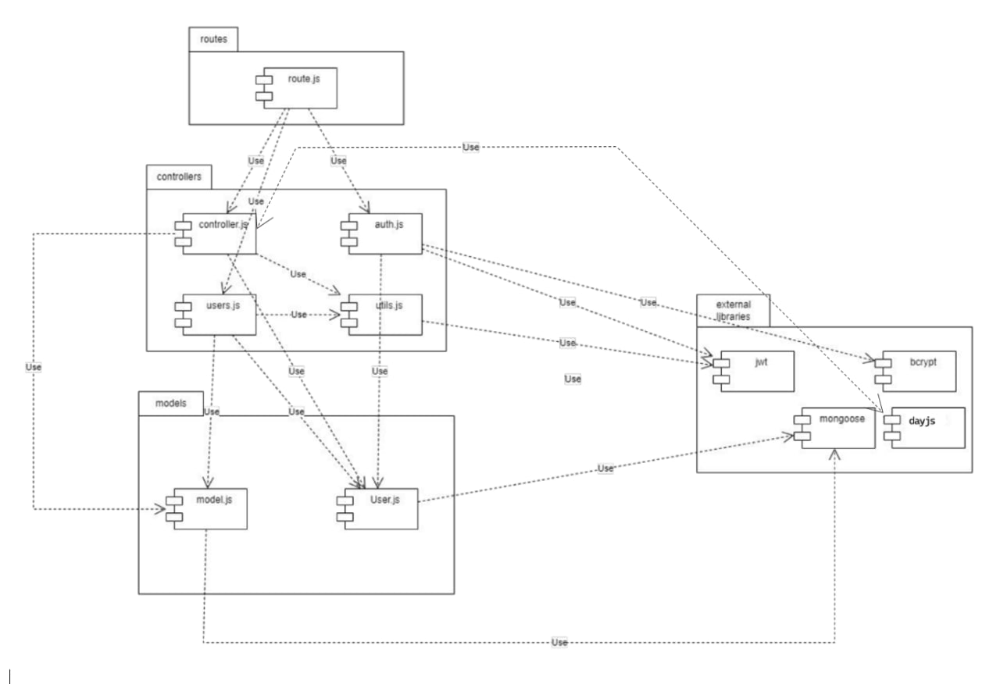
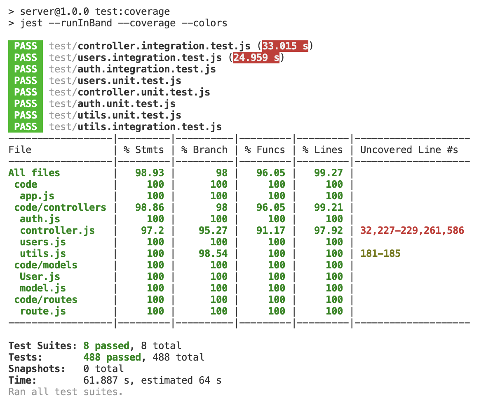

# Test Report

<The goal of this document is to explain how the application was tested, detailing how the test cases were defined and what they cover>

# Contents

- [Dependency graph](#dependency-graph)

- [Integration approach](#integration-approach)

- [Tests](#tests)

- [Coverage](#Coverage)

# Dependency graph 

     
# Integration approach

    <Write here the integration sequence you adopted, in general terms (top down, bottom up, mixed) and as sequence
    (ex: step1: unit A, step 2: unit A+B, step 3: unit A+B+C, etc)> 
    <Some steps may  correspond to unit testing (ex step1 in ex above)>
    <One step will  correspond to API testing, or testing unit route.js>

   The integration approach used is the mixed approach. The testing process followed the steps outlined below:

Step 1: `utils.js`
- The integration testing started with the `utils.js` component, which likely contains utility functions with minimal dependencies.

Step 2: some `get` and `delete` functions in `users.js` and `controller.js` 
- The next step involved integrating and testing the `get` and `delete` functions in `users.js` and `controller.js`. These functions were selected because they have fewer dependencies on core or fundamental functions.

Step 3: `get` functions in `controller.js` (with dependencies on `utils.js` functions)

Step 4: Functions for `add` and `modify` in `users.js`
- The next stage involved integrating and testing the functions responsible for the `add` and `modify` operations in `users.js`. These functions may be more complex and likely have dependencies on other components.

Step 5: Last `get` and `delete` functions in `users.js` 
- The integration and testing of the remaining `get` and `delete` functions in `users.js` were conducted. These functions likely have fewer dependencies on the functions introduced in step 4.

Step 6: Functions in `auth.js`
 - The integration approach covers the integration and testing of the auth.js component, enabling comprehensive testing of the registration, login, and logout functionalities within the system.

By following this mixed integration approach, the testing process progressively integrated more complex functions while also addressing simpler functions with fewer dependencies. This approach allows for thorough testing and identification of any issues throughout the integration process.
    

# Tests

   <in the table below list the test cases defined For each test report the object tested, the test level (API, integration, unit) and the technique used to define the test case  (BB/ eq partitioning, BB/ boundary, WB/ statement coverage, etc)>   <split the table if needed>

| Test case name | Object(s) tested | Test level | Technique used |
|--|--|--|--|
|Register: should return 500 error if some generic error occurs | Register function | unit | WB with statement coverage |
|Register: should register a new user successfully | Register function | unit | WB with statement coverage |
|Register: should return an error when some attributes are missing | Register function | unit | WB with statement coverage |
|Register: should return an error when there are too many attributes | Register function | unit | WB with statement coverage |
|Register: should return an error when trying to insert an empty string | Register function | unit | WB with statement coverage |
|Register: should return an error when the email format is not valid | Register function | unit | WB with statement coverage |
|Register: should return an error when the email is already used | Register function | unit | WB with statement coverage |
|Register: should return an error when the username is already used | Register function | unit | WB with statement coverage |
| RegisterAdmin: should return an error if attributes are missing in the request body | RegisterAdmin function   | unit       | WB with statement coverage |
| RegisterAdmin: should return an error if there are too many attributes in the request body | RegisterAdmin function   | unit       | WB with statement coverage |
| RegisterAdmin: should return an error if any attribute is an empty string | RegisterAdmin function   | unit       | WB with statement coverage |
| RegisterAdmin: should return an error if the email is not valid | RegisterAdmin function   | unit       | WB with statement coverage |
| RegisterAdmin: should return an error if the email is already used | RegisterAdmin function   | unit       | WB with statement coverage |
| RegisterAdmin: should return an error if the username is already used | RegisterAdmin function   | unit       | WB with statement coverage |
| RegisterAdmin: should register a new admin user successfully | RegisterAdmin function   | unit       | WB with statement coverage |
| RegisterAdmin: should return a server error if an exception is thrown | RegisterAdmin function   | unit       | WB with statement coverage |
| Login: should return a 400 response if the username does not correspond to a registered user | Login function   | unit       | WB with statement coverage |
| Login: should return a 500 response with an error message | Login function   | unit       | WB with statement coverage |
| Login: should return an error when some attributes are missing | Login function   | unit       | WB with statement coverage |
| Login: should return an error when trying to insert an empty string | Login function   | unit       | WB with statement coverage |
| Login: should return an error when the email format is not valid | Login function   | unit       | WB with statement coverage |
| Login: should return a 400 response if the password provided is wrong | Login function   | unit       | WB with statement coverage |
| Login: should return a 200 response with access and refresh tokens | Login function   | unit       | WB with statement coverage |
| Logout: should return an error when the refresh token is missing | Logout function   | unit       | WB with statement coverage |
| Logout: should return an error when the user is not found | Logout function   | unit       | WB with statement coverage |
| Logout: should logout a user successfully | Logout function   | unit       | WB with statement coverage |
| Logout: should return error 500 if error during save | Logout function   | unit       | WB with statement coverage |
| createCategory: should return 401 if not authenticated as admin | createCategory function | unit | WB with statement coverage |
| createCategory: should return 400 if type or color parameters are missing | createCategory function | unit | WB with statement coverage |
| createCategory: should return 400 if type or color parameters are invalid | createCategory function | unit | WB with statement coverage |
| createCategory: should return 400 if category already exists | createCategory function | unit | WB with statement coverage |
| createCategory: should create a new category | createCategory function | unit | WB with statement coverage |
| createCategory: should return 500 if an error occurs before category creation | createCategory function | unit | WB with statement coverage |
| createCategory: should return 500 if an error occurs within category creation | createCategory function | unit | WB with statement coverage |
| updateCategory: should return 401 if not authenticated as admin | updateCategory function | unit | WB with statement coverage |
| updateCategory: should return 400 if category is not found | updateCategory function | unit | WB with statement coverage |
| updateCategory: should return 400 if invalid type/color | updateCategory function | unit | WB with statement coverage |
| updateCategory: should return 400 if the new category type already exists | updateCategory function | unit | WB with statement coverage |
| updateCategory: should return 500 if an error occurs | updateCategory function | unit | WB with statement coverage |
| updateCategory: should update category and return success message | updateCategory function | unit | WB with statement coverage |
| deleteCategory: should return 500 if an error occurs | deleteCategory function | unit | WB with statement coverage |
| deleteCategory: should return 400 if not authenticated as admin | deleteCategory function | unit | WB with statement coverage |
| deleteCategory: should return 400 if some attributes are missing in the request body | deleteCategory function | unit | WB with statement coverage |
| deleteCategory: should return 400 if attempting to delete the last category | deleteCategory function | unit | WB with statement coverage |
| deleteCategory: should return 400 if one or more category types are not valid | deleteCategory function | unit | WB with statement coverage |
| deleteCategory: should return 400 if the category list is empty | deleteCategory function | unit | WB with statement coverage |
| deleteCategory: should delete categories and update transactions, case types.length < count | deleteCategory function | unit | WB with statement coverage |
| deleteCategory: should delete categories and update transactions, case types.length == count | deleteCategory function | unit | WB with statement coverage |
| getCategories: should return all categories with status 200  | getCategories function    | Unit       | White Box with Statement Coverage |
| getCategories: should return 401 if not authenticated as a simple user | getCategories function    | Unit       | White Box with Statement Coverage |
| getCategories: should return 500 if an error occurs           | getCategories function    | Unit       | White Box with Statement Coverage |
| createTransaction: should return 401 if not authenticated as user                   | createTransaction function  | Unit       | White Box with Statement Coverage |
| createTransaction: should return 400 if username passed to route is different        | createTransaction function  | Unit       | White Box with Statement Coverage |
| createTransaction: should return 400 if required parameters are missing              | createTransaction function  | Unit       | White Box with Statement Coverage |
| createTransaction: should return 400 if username, amount, or type are invalid        | createTransaction function  | Unit       | White Box with Statement Coverage |
| createTransaction: should return 400 if amount is not a number                      | createTransaction function  | Unit       | White Box with Statement Coverage |
| createTransaction: should return 400 if username or category type does not exist     | createTransaction function  | Unit       | White Box with Statement Coverage |
| createTransaction: should create a new transaction and return the data               | createTransaction function  | Unit       | White Box with Statement Coverage |
| getAllTransactions: should return a 401 error for a non-admin user                                     | getAllTransactions function  | Unit       | White Box with Statement Coverage |
| getAllTransactions: should return a 500 error if a generic error occurs                               | getAllTransactions function  | Unit       | White Box with Statement Coverage |
| getAllTransactions: should return all transactions with category information for an admin user         | getAllTransactions function  | Unit       | White Box with Statement Coverage |
| getTransactionsByUser: should return a 400 error if the username passed as a route parameter does not represent a user in the database                                           | getTransactionsByUser function | Unit       | White Box with Statement Coverage |
| getTransactionsByUser: should return filtered transactions with category information for a user accessing /api/users/:username/transactions route                             | getTransactionsByUser function | Unit       | White Box with Statement Coverage |
| getTransactionsByUser: should return error 401 for a non authorized user in user route /api/transactions/users/:username route                                              | getTransactionsByUser function | Unit       | White Box with Statement Coverage |
| getTransactionsByUser: should return error 401 for an user accessing admin route /api/transactions/users/:username route                                                     | getTransactionsByUser function | Unit       | White Box with Statement Coverage |
| getTransactionsByUser: should return filtered transactions with category information for an admin accessing /api/transactions/users/:username route                           | getTransactionsByUser function | Unit       | White Box with Statement Coverage |
| getTransactionsByUser: should return a 500 error if an error occurs during the operation                                                                                        | getTransactionsByUser function | Unit       | White Box with Statement Coverage |
| getTransactionsByUserByCategory: should return filtered transactions with category information for a user accessing /api/users/:username/transactions/category/:category route | getTransactionsByUserByCategory | Unit | WB with statement coverage |
| getTransactionsByUserByCategory: should return a 400 error if the category does not exist | getTransactionsByUserByCategory | Unit | WB with statement coverage |
| getTransactionsByUserByCategory: should return a 400 error if the user does not exist | getTransactionsByUserByCategory | Unit | WB with statement coverage |
| getTransactionsByUserByCategory: should return a 401 error if an authenticated user is not the same as the user in the route (authType = User) | getTransactionsByUserByCategory | Unit | WB with statement coverage |
| getTransactionsByUserByCategory: should return 401 if the user verifyAuth fails for a user accessing the user route | getTransactionsByUserByCategory | Unit | WB with statement coverage |
| getTransactionsByUserByCategory: should return 401 if the admin verifyAuth fails for an admin accessing the admin route (authType = Admin) | getTransactionsByUserByCategory | Unit | WB with statement coverage |
| getTransactionsByUserByCategory: should return transactions for an admin (authType = Admin) | getTransactionsByUserByCategory | Unit | WB with statement coverage |
| getTransactionsByUserByCategory: should return a 500 error if an internal server error occurs | getTransactionsByUserByCategory | Unit | WB with statement coverage |
| getTransactionsByGroup: should return a 400 error if the requested group does not exist | getTransactionsByGroup | Unit | WB with statement coverage |
| getTransactionsByGroup: should return a 401 error if an authenticated user is not part of the group | getTransactionsByGroup | Unit | WB with statement coverage |
| getTransactionsByGroup: should return a 401 error if an authenticated user is not an admin accessing the admin route | getTransactionsByGroup | Unit | WB with statement coverage |
| getTransactionsByGroup: should return a 500 error if an internal server error occurs | getTransactionsByGroup | Unit | WB with statement coverage |
| getTransactionsByGroup: should return all transactions made by members of a specific group | getTransactionsByGroup | Unit | WB with statement coverage |
| getTransactionsByGroupByCategory: should return a 400 error if the group does not exist | getTransactionsByGroupByCategory | Unit | WB with statement coverage |
| getTransactionsByGroupByCategory: should return a 400 error if the category does not exist | getTransactionsByGroupByCategory | Unit | WB with statement coverage |
| getTransactionsByGroupByCategory: should return a 401 error for unauthorized access | getTransactionsByGroupByCategory | Unit | WB with statement coverage |
| getTransactionsByGroupByCategory: should handle errors and return a 500 status | getTransactionsByGroupByCategory | Unit | WB with statement coverage |
| getTransactionsByGroupByCategory: should return transactions for a specific group and category | getTransactionsByGroupByCategory | Unit | WB with statement coverage |
| deleteTransaction: should return a 500 error if generic error occurs | deleteTransaction | Unit | WB with statement coverage |
| deleteTransaction: should return a 400 error if the provided transaction does not exist | deleteTransaction | Unit | WB with statement coverage |
| deleteTransaction: should return a 400 error if the provided transaction does not belong to the user | deleteTransaction | Unit | WB with statement coverage |
| deleteTransaction: should delete the transaction if the user is authorized and the transaction exists | deleteTransaction | Unit | WB with statement coverage |
| deleteTransaction: should return a 401 error if the user is not authorized | deleteTransaction | Unit | WB with statement coverage |
| deleteTransaction: should return a 400 error if the attribute in the body is missing | deleteTransaction | Unit | WB with statement coverage |
| deleteTransaction: should return a 400 error if the attribute in an empty string | deleteTransaction | Unit | WB with statement coverage |
| deleteTransactions: should delete the transactions if the user is an admin and the ids are valid | deleteTransactions | Unit | WB with statement coverage |
| deleteTransactions: should return a 401 error if the user is not an admin | deleteTransactions | Unit | WB with statement coverage |
| deleteTransactions: should return a 400 error if the attribute in the body is missing | deleteTransactions | Unit | WB with statement coverage |
| deleteTransactions: should return a 400 error if there are too many attributes in the body | deleteTransactions | Unit | WB with statement coverage |
| deleteTransactions: should return a 401 error if one or more ids are not found | deleteTransactions | Unit | WB with statement coverage |
| deleteTransactions: should return a 401 error if the id list is empty | deleteTransactions | Unit | WB with statement coverage |
| deleteTransactions: should return a 500 error if an internal server error occurs | deleteTransactions | Unit | WB with statement coverage |
| getUsers: should return a list of users if the user is an admin | getUsers | Unit | WB with statement coverage |
| getUsers: should return a 401 error if the user is not an admin | getUsers | Unit | WB with statement coverage |
| getUsers: should return a 500 error if an internal server error occurs | getUsers | Unit | WB with statement coverage |
| getUser: should return 401 if user is not an admin and not searching for their own info | getUser | Unit | WB with statement coverage |
| getUser: should return 400 if user does not exist | getUser | Unit | WB with statement coverage |
| getUser: should retrieve user information if user is an admin | getUser | Unit | WB with statement coverage |
| getUser: should retrieve user information if user is searching for their own info | getUser | Unit | WB with statement coverage |
| getUser: error 500, empty request | getUser | Unit | WB with statement coverage |
|createGroup: should return status 401 if the user does not pass the simple authentication| createGroup| Unit |WB with statement coverage |
|createGroup: should return status 400 if the attribute memberEmails is missing in the body| createGroup|Unit | WB with statement coverage|
|createGroup: should return status 400 if the attribute name is missing in the body| createGroup| Unit|WB with statement coverage |
|createGroup: should return status 400 if the name group is a whitespace| createGroup| Unit| WB with statement coverage|
|createGroup: should return status 400 if the there are not mail in member emails| createGroup | Unit| WB with statement coverage|
|createGroup: should return status 400 if there is already a group with the provided name|createGroup | Unit| WB with statement coverage|
|createGroup: should return status 400 if there are one or more mail in invalid format|createGroup | Unit| WB with statement coverage|
|createGroup: should return status 400 if there are one or more empty mail| createGroup| Unit| WB with statement coverage|
|createGroup: should return status 400 if the user who wants to create the group is already in one| createGroup | Unit|WB with statement coverage |
|createGroup: should return status 400 if all the email in membersEmail does not exist| createGroup|Unit | WB with statement coverage|
|createGroup: should return status 400 if all the email in members email are already in a group| createGroup| Unit| WB with statement coverage|
| getGroups: should return error 401 if the user is not an admin | getGroups        | unit       | WB with statement coverage |
| getGroups: should return success with the status 200 even though there are no groups | getGroups        | unit       | WB with statement coverage |
| getGroups: should return success with the status 200 showing all the groups | getGroups        | unit       | WB with statement coverage |
| getGroups: should return 500 if there is an internal server error | getGroups        | unit       | WB with statement coverage |
| getGroup: should return error with status 400 if the group does not exist | getGroup         | unit       | WB with statement coverage     |
| getGroup: should return error 401 if the user is not an admin and not a member of the group | getGroup         | unit       | WB with statement coverage     |
| getGroup: should return status 200 showing the group if the user is an admin | getGroup         | unit       | WB with statement coverage     |
| getGroup: should return status 200 showing the group if the user is not an admin but a member of the group| getGroup         | unit       | WB with statement coverage     |
| getGroup: should return 500 if there is an internal server error | getGroup         | unit       | WB with statement coverage     |
| addToGroup: should return 400 if the attribute email is not defined| addToGroup| Unit| WB with statement coverage|
| addToGroup: should return 400 if the group not exist| addToGroup| Unit| WB with statement coverage|
| addToGroup: should return 401 if the user is not an admin with the route for admin| addToGroup| Unit| WB with statement coverage|
| addToGroup: should return 401 if the user is not in the group with the route for users| addToGroup| Unit| WB with statement coverage|
| addToGroup: should return 400 if the list of emails is empty| addToGroup| Unit| WB with statement coverage|
| addToGroup: should return 400 if the list of emails has at least one invalid email| addToGroup| Unit| WB with statement coverage|
| addToGroup: should return 400 if the list of emails has at least one email as an empty string| addToGroup| Unit| WB with statement coverage|
| addToGroup: should return 400 if all the emails are not in the database| addToGroup| Unit| WB with statement coverage|
| addToGroup: should return 400 if all members are already in a group| addToGroup| Unit| WB with statement coverage|
| addToGroup: should return 400 if all members are already in a group or not exist| addToGroup| Unit| WB with statement coverage|
| addToGroup: should return 200 if there are some valid members in the list(is an admin)| addToGroup| Unit| WB with statement coverage|
| addToGroup: should return 200, there are only valid members in the list(is an admin)| addToGroup| Unit| WB with statement coverage|
| addToGroup: should return 200 if there are some valid members in the list (is a user)| addToGroup| Unit| WB with statement coverage|
| addToGroup: Should return 500 if there is an internal server error| addToGroup| Unit| WB with statement coverage|
| removeFromGroup: should return 400 if the attribute email is not defined| removeFromGroup| Unit| WB with statement coverage|
| removeFromGroup: should return 400 if the group not exist| removeFromGroup| Unit| WB with statement coverage|
| removeFromGroup: should return 401 if the user is not an admin with the route for admin| removeFromGroup| Unit| WB with statement coverage|
| removeFromGroup: should return 401 if the user is not in the group with the route for users| removeFromGroup| Unit| WB with statement coverage|
| removeFromGroup: should return 400 if the group has only one member| removeFromGroup| Unit| WB with statement coverage|
| removeFromGroup: should return 400 if the list of emails is empty| removeFromGroup| Unit| WB with statement coverage|
| removeFromGroup: should return 400 if the list of emails has at least one invalid email| removeFromGroup| Unit| WB with statement coverage|
| removeFromGroup: should return 400 if the list of emails has at least one email as an empty string| removeFromGroup| Unit| WB with statement coverage|
| removeFromGroup: should return 400 if all the emails are not in the database| removeFromGroup| Unit| WB with statement coverage|
| removeFromGroup: should return 400 if all members are not in the group| removeFromGroup| Unit| WB with statement coverage|
| removeFromGroup: should return 400 if all members are not in the group or not exist| removeFromGroup| Unit| WB with statement coverage|
| removeFromGroup: should return 200 if there are some valid members in the list(is an admin)| removeFromGroup| Unit| WB with statement coverage|
| removeFromGroup: should return 200 if there are some valid members in the list- try to remove all(is an admin)| removeFromGroup| Unit| WB with statement coverage|
| removeFromGroup: should return 200 if there are some valid members in the list (is a user)| removeFromGroup| Unit| WB with statement coverage|
| removeFromGroup: should return 200 if there are only valid members in the list (is a user)| removeFromGroup| Unit| WB with statement coverage|
| removeFromGroup: Should return 500 if there is an internal server error| removeFromGroup| Unit| WB with statement coverage|
| deleteUser: should return 401 if the user is not an admin| deleteUser| Unit| WB with statement coverage|
| deleteUser: should return 400 if the attribute email is missing| deleteUser| Unit| WB with statement coverage|
| deleteUser: should return 400 if the email is an empty string| deleteUser| Unit| WB with statement coverage|
| deleteUser: should return 400 if the email is an invalid email| deleteUser| Unit| WB with statement coverage|
| deleteUser: should return 400 if the user not exist| deleteUser| Unit| WB with statement coverage|
| deleteUser: should return 400 if the user is an admin| deleteUser| Unit| WB with statement coverage|
| deleteUser: should return 200 if the user is successfully deleted (no group, no transactions)| deleteUser| Unit| WB with statement coverage|
| deleteUser: should return 200 if the user is successfully deleted (is in a group, some transactions)| deleteUser| Unit| WB with statement coverage|
| deleteUser: should return 200 if the user is successfully deleted (is in a group and the last member, some transactions)| deleteUser| Unit| WB with statement coverage|
| deleteUser: Should return 500 if there is an internal server error| deleteUser| Unit| WB with statement coverage|
| deleteGroup: should return 401 if the user is not an admin  | deleteGroup      | unit       | WB with statement coverage     |
| deleteGroup: should return 400 if the attribute name is missing| deleteGroup      | unit       | WB with statement coverage     |
| deleteGroup: should return 400 if the name is an empty string  | deleteGroup      | unit       | WB with statement coverage     |
| deleteGroup: should return 400 if the group does not exist | deleteGroup      | unit       | WB with statement coverage     |
| deleteGroup: should return 200 if the group is successfully deleted| deleteGroup      | unit       | WB with statement coverage     |
| deleteGroup: should return 500 if there is an internal server error | deleteGroup      | unit       | WB with statement coverage     |
| handleDateFilterParams: empty req| handleDateFilterParams | Unit| WB with statement coverage|
| handleDateFilterParams: Date tests| handleDateFilterParams | Unit| WB with statement coverage|
| handleDateFilterParams: From tests| handleDateFilterParams | Unit| WB with statement coverage|
| handleDateFilterParams: upTo parameter| handleDateFilterParams | Unit| WB with statement coverage|
| handleDateFilterParams: Date and upTo or from test| handleDateFilterParams | Unit| WB with statement coverage|
| handleDateFilterParams: from and upTo| handleDateFilterParams | Unit| WB with statement coverage|
| verifyAuth: AccessToken is valid| verifyAuth | Unit| WB with statement coverage|
| verifyAuth: AccessToken is expired| verifyAuth | Unit| WB with statement coverage|
| handleAmountFilterParams: Test on min| handleAmountFilterParams | Unit| WB with statement coverage|
| handleAmountFilterParams: Test on max| handleAmountFilterParams | Unit| WB with statement coverage|
| handleAmountFilterParams: Test with min and max parameter| handleAmountFilterParams | Unit| WB with statement coverage|
|Register: should return 500 error if some generic error occurs | Register function | API | BB |
|Register: should register a new user successfully | Register function | API | BB |
|Register: should return an error when some attributes are missing | Register function | API | BB |
|Register: should return an error when there are too many attributes | Register function | API | BB |
|Register: should return an error when trying to insert an empty string | Register function | API | BB |
|Register: should return an error when the email format is not valid | Register function | API | BB |
|Register: should return an error when the email is already used | Register function | API | BB |
|Register: should return an error when the username is already used | Register function | API | BB |
| RegisterAdmin: should return an error if attributes are missing in the request body | RegisterAdmin function   | API       | BB |
| RegisterAdmin: should return an error if there are too many attributes in the request body | RegisterAdmin function   | API       | BB |
| RegisterAdmin: should return an error if any attribute is an empty string | RegisterAdmin function   | API       | BB |
| RegisterAdmin: should return an error if the email is not valid | RegisterAdmin function   | API       | BB |
| RegisterAdmin: should return an error if the email is already used | RegisterAdmin function   | API       | BB |
| RegisterAdmin: should return an error if the username is already used | RegisterAdmin function   | API       | BB |
| RegisterAdmin: should register a new admin user successfully | RegisterAdmin function   | API       | BB |
| RegisterAdmin: should return a server error if an exception is thrown | RegisterAdmin function   | API       | BB |
| Login: should return a 400 response if the username does not correspond to a registered user | Login function   | API       | BB |
| Login: should return a 500 response with an error message | Login function   | API       | BB |
| Login: should return an error when some attributes are missing | Login function   | API       | BB |
| Login: should return an error when trying to insert an empty string | Login function   | API       | BB |
| Login: should return an error when the email format is not valid | Login function   | API       | BB |
| Login: should return a 400 response if the password provided is wrong | Login function   | API       | BB |
| Login: should return a 200 response with access and refresh tokens | Login function   | API       | BB |
| Logout: should return an error when the refresh token is missing | Logout function   | API       | BB |
| Logout: should return an error when the user is not found | Logout function   | API       | BB |
| Logout: should logout a user successfully | Logout function   | API       | BB |
| Logout: should return error 500 if error during save | Logout function   | API       | BB |
| createCategory: should return 401 if not authenticated as admin | createCategory function | API | BB |
| createCategory: should return 400 if type or color parameters are missing | createCategory function | API | BB |
| createCategory: should return 400 if type or color parameters are invalid | createCategory function | API | BB |
| createCategory: should return 400 if category already exists | createCategory function | API | BB |
| createCategory: should create a new category | createCategory function | API | BB |
| createCategory: should return 500 if an error occurs before category creation | createCategory function | API | BB |
| createCategory: should return 500 if an error occurs within category creation | createCategory function | API | BB |
| updateCategory: should return 401 if not authenticated as admin | updateCategory function | API | BB |
| updateCategory: should return 400 if category is not found | updateCategory function | API | BB |
| updateCategory: should return 400 if invalid type/color | updateCategory function | API | BB |
| updateCategory: should return 400 if the new category type already exists | updateCategory function | API | BB |
| updateCategory: should return 500 if an error occurs | updateCategory function | API | BB |
| updateCategory: should update category and return success message | updateCategory function | API | BB |
| deleteCategory: should return 500 if an error occurs | deleteCategory function | API | BB |
| deleteCategory: should return 400 if not authenticated as admin | deleteCategory function | API | BB |
| deleteCategory: should return 400 if some attributes are missing in the request body | deleteCategory function | API | BB |
| deleteCategory: should return 400 if attempting to delete the last category | deleteCategory function | API | BB |
| deleteCategory: should return 400 if one or more category types are not valid | deleteCategory function | API | BB |
| deleteCategory: should return 400 if the category list is empty | deleteCategory function | API | BB |
| deleteCategory: should delete categories and update transactions, case types.length < count | deleteCategory function | API | BB |
| deleteCategory: should delete categories and update transactions, case types.length == count | deleteCategory function | API | BB |
| getCategories: should return all categories with status 200  | getCategories function    | API       | BB |
| getCategories: should return 401 if not authenticated as a simple user | getCategories function    | API       | BB |
| getCategories: should return 500 if an error occurs           | getCategories function    | API       | BB |
| createTransaction: should return 401 if not authenticated as user                   | createTransaction function  | API       | BB |
| createTransaction: should return 400 if username passed to route is different        | createTransaction function  | API       | BB |
| createTransaction: should return 400 if required parameters are missing              | createTransaction function  | API       | BB |
| createTransaction: should return 400 if username, amount, or type are invalid        | createTransaction function  | API       | BB |
| createTransaction: should return 400 if amount is not a number                      | createTransaction function  | API       | BB |
| createTransaction: should return 400 if username or category type does not exist     | createTransaction function  | API       | BB |
| createTransaction: should create a new transaction and return the data               | createTransaction function  | API       | BB |
| getAllTransactions: should return a 401 error for a non-admin user                                     | getAllTransactions function  | API       | BB |
| getAllTransactions: should return a 500 error if a generic error occurs                               | getAllTransactions function  | API       | BB |
| getAllTransactions: should return all transactions with category information for an admin user         | getAllTransactions function  | API       | BB |
| getTransactionsByUser: should return a 400 error if the username passed as a route parameter does not represent a user in the database                                           | getTransactionsByUser function | API       | BB |
| getTransactionsByUser: should return filtered transactions with category information for a user accessing /api/users/:username/transactions route                             | getTransactionsByUser function | API       | BB |
| getTransactionsByUser: should return error 401 for a non authorized user in user route /api/transactions/users/:username route                                              | getTransactionsByUser function | API       | BB |
| getTransactionsByUser: should return error 401 for an user accessing admin route /api/transactions/users/:username route                                                     | getTransactionsByUser function | API       | BB |
| getTransactionsByUser: should return filtered transactions with category information for an admin accessing /api/transactions/users/:username route                           | getTransactionsByUser function | API       | BB |
| getTransactionsByUser: should return a 500 error if an error occurs during the operation                                                                                        | getTransactionsByUser function | API       | BB |
| getTransactionsByUserByCategory: should return filtered transactions with category information for a user accessing /api/users/:username/transactions/category/:category route | getTransactionsByUserByCategory | API | BB |
| getTransactionsByUserByCategory: should return a 400 error if the category does not exist | getTransactionsByUserByCategory | API | BB |
| getTransactionsByUserByCategory: should return a 400 error if the user does not exist | getTransactionsByUserByCategory | API | BB |
| getTransactionsByUserByCategory: should return a 401 error if an authenticated user is not the same as the user in the route (authType = User) | getTransactionsByUserByCategory | API | BB |
| getTransactionsByUserByCategory: should return 401 if the user verifyAuth fails for a user accessing the user route | getTransactionsByUserByCategory | API | BB |
| getTransactionsByUserByCategory: should return 401 if the admin verifyAuth fails for an admin accessing the admin route (authType = Admin) | getTransactionsByUserByCategory | API | BB |
| getTransactionsByUserByCategory: should return transactions for an admin (authType = Admin) | getTransactionsByUserByCategory | API | BB |
| getTransactionsByUserByCategory: should return a 500 error if an internal server error occurs | getTransactionsByUserByCategory | API | BB |
| getTransactionsByGroup: should return a 400 error if the requested group does not exist | getTransactionsByGroup | API | BB |
| getTransactionsByGroup: should return a 401 error if an authenticated user is not part of the group | getTransactionsByGroup | API | BB |
| getTransactionsByGroup: should return a 401 error if an authenticated user is not an admin accessing the admin route | getTransactionsByGroup | API | BB |
| getTransactionsByGroup: should return a 500 error if an internal server error occurs | getTransactionsByGroup | API | BB |
| getTransactionsByGroup: should return all transactions made by members of a specific group | getTransactionsByGroup | API | BB |
| getTransactionsByGroupByCategory: should return a 400 error if the group does not exist | getTransactionsByGroupByCategory | API | BB |
| getTransactionsByGroupByCategory: should return a 400 error if the category does not exist | getTransactionsByGroupByCategory | API | BB |
| getTransactionsByGroupByCategory: should return a 401 error for unauthorized access | getTransactionsByGroupByCategory | API | BB |
| getTransactionsByGroupByCategory: should handle errors and return a 500 status | getTransactionsByGroupByCategory | API | BB |
| getTransactionsByGroupByCategory: should return transactions for a specific group and category | getTransactionsByGroupByCategory | API | BB |
| deleteTransaction: should return a 500 error if generic error occurs | deleteTransaction | API | BB |
| deleteTransaction: should return a 400 error if the provided transaction does not exist | deleteTransaction | API | BB |
| deleteTransaction: should return a 400 error if the provided transaction does not belong to the user | deleteTransaction | API | BB |
| deleteTransaction: should delete the transaction if the user is authorized and the transaction exists | deleteTransaction | API | BB |
| deleteTransaction: should return a 401 error if the user is not authorized | deleteTransaction | API | BB |
| deleteTransaction: should return a 400 error if the attribute in the body is missing | deleteTransaction | API | BB |
| deleteTransaction: should return a 400 error if the attribute in an empty string | deleteTransaction | API | BB |
| deleteTransactions: should delete the transactions if the user is an admin and the ids are valid | deleteTransactions | API | BB |
| deleteTransactions: should return a 401 error if the user is not an admin | deleteTransactions | API | BB |
| deleteTransactions: should return a 400 error if the attribute in the body is missing | deleteTransactions | API | BB |
| deleteTransactions: should return a 400 error if there are too many attributes in the body | deleteTransactions | API | BB |
| deleteTransactions: should return a 401 error if one or more ids are not found | deleteTransactions | API | BB |
| deleteTransactions: should return a 401 error if the id list is empty | deleteTransactions | API | BB |
| deleteTransactions: should return a 500 error if an internal server error occurs | deleteTransactions | API | BB |
| getUsers: should return a list of users if the user is an admin | getUsers | API | BB |
| getUsers: should return a 401 error if the user is not an admin | getUsers | API | BB |
| getUsers: should return a 500 error if an internal server error occurs | getUsers | API | BB |
| getUser: should return 401 if user is not an admin and not searching for their own info | getUser | API | BB |
| getUser: should return 400 if user does not exist | getUser | API | BB |
| getUser: should retrieve user information if user is an admin | getUser | API | BB |
| getUser: should retrieve user information if user is searching for their own info | getUser | API | BB |
| getUser: error 500, empty request | getUser | API | BB |
|createGroup: should return status 401 if the user does not pass the simple authentication| createGroup| API |BB |
|createGroup: should return status 400 if the attribute memberEmails is missing in the body| createGroup|API | BB|
|createGroup: should return status 400 if the attribute name is missing in the body| createGroup| API|BB |
|createGroup: should return status 400 if the name group is a whitespace| createGroup| API| BB|
|createGroup: should return status 400 if the there are not mail in member emails| createGroup | API| BB|
|createGroup: should return status 400 if there is already a group with the provided name|createGroup | API| BB|
|createGroup: should return status 400 if there are one or more mail in invalid format|createGroup | API| BB|
|createGroup: should return status 400 if there are one or more empty mail| createGroup| API| BB|
|createGroup: should return status 400 if the user who wants to create the group is already in one| createGroup | API|BB |
|createGroup: should return status 400 if all the email in membersEmail does not exist| createGroup|API | BB|
|createGroup: should return status 400 if all the email in members email are already in a group| createGroup| API| BB|
| getGroups: should return error 401 if the user is not an admin | getGroups        | API       | BB |
| getGroups: should return success with the status 200 even though there are no groups | getGroups        | API       | BB |
| getGroups: should return success with the status 200 showing all the groups | getGroups        | API       | BB |
| getGroups: should return 500 if there is an internal server error | getGroups        | API       | BB |
| getGroup: should return error with status 400 if the group does not exist | getGroup         | API       | BB     |
| getGroup: should return error 401 if the user is not an admin and not a member of the group | getGroup         | API       | BB     |
| getGroup: should return status 200 showing the group if the user is an admin | getGroup         | API       | BB     |
| getGroup: should return status 200 showing the group if the user is not an admin but a member of the group| getGroup         | API       | BB     |
| getGroup: should return 500 if there is an internal server error | getGroup         | API       | BB     |
| addToGroup: should return 400 if the attribute email is not defined| addToGroup| API| BB|
| addToGroup: should return 400 if the group not exist| addToGroup| API| BB|
| addToGroup: should return 401 if the user is not an admin with the route for admin| addToGroup| API| BB|
| addToGroup: should return 401 if the user is not in the group with the route for users| addToGroup| API| BB|
| addToGroup: should return 400 if the list of emails is empty| addToGroup| API| BB|
| addToGroup: should return 400 if the list of emails has at least one invalid email| addToGroup| API| BB|
| addToGroup: should return 400 if the list of emails has at least one email as an empty string| addToGroup| API| BB|
| addToGroup: should return 400 if all the emails are not in the database| addToGroup| API| BB|
| addToGroup: should return 400 if all members are already in a group| addToGroup| API| BB|
| addToGroup: should return 400 if all members are already in a group or not exist| addToGroup| API| BB|
| addToGroup: should return 200 if there are some valid members in the list(is an admin)| addToGroup| API| BB|
| addToGroup: should return 200, there are only valid members in the list(is an admin)| addToGroup| API| BB|
| addToGroup: should return 200 if there are some valid members in the list (is a user)| addToGroup| API| BB|
| addToGroup: Should return 500 if there is an internal server error| addToGroup| API| BB|
| removeFromGroup: should return 400 if the attribute email is not defined| removeFromGroup| API| BB|
| removeFromGroup: should return 400 if the group not exist| removeFromGroup| API| BB|
| removeFromGroup: should return 401 if the user is not an admin with the route for admin| removeFromGroup| API| BB|
| removeFromGroup: should return 401 if the user is not in the group with the route for users| removeFromGroup| API| BB|
| removeFromGroup: should return 400 if the group has only one member| removeFromGroup| API| BB|
| removeFromGroup: should return 400 if the list of emails is empty| removeFromGroup| API| BB|
| removeFromGroup: should return 400 if the list of emails has at least one invalid email| removeFromGroup| API| BB|
| removeFromGroup: should return 400 if the list of emails has at least one email as an empty string| removeFromGroup| API| BB|
| removeFromGroup: should return 400 if all the emails are not in the database| removeFromGroup| API| BB|
| removeFromGroup: should return 400 if all members are not in the group| removeFromGroup| API| BB|
| removeFromGroup: should return 400 if all members are not in the group or not exist| removeFromGroup| API| BB|
| removeFromGroup: should return 200 if there are some valid members in the list(is an admin)| removeFromGroup| API| BB|
| removeFromGroup: should return 200 if there are some valid members in the list- try to remove all(is an admin)| removeFromGroup| API| BB|
| removeFromGroup: should return 200 if there are some valid members in the list (is a user)| removeFromGroup| API| BB|
| removeFromGroup: should return 200 if there are only valid members in the list (is a user)| removeFromGroup| API| BB|
| removeFromGroup: Should return 500 if there is an internal server error| removeFromGroup| API| BB|
| deleteUser: should return 401 if the user is not an admin| deleteUser| API| BB|
| deleteUser: should return 400 if the attribute email is missing| deleteUser| API| BB|
| deleteUser: should return 400 if the email is an empty string| deleteUser| API| BB|
| deleteUser: should return 400 if the email is an invalid email| deleteUser| API| BB|
| deleteUser: should return 400 if the user not exist| deleteUser| API| BB|
| deleteUser: should return 400 if the user is an admin| deleteUser| API| BB|
| deleteUser: should return 200 if the user is successfully deleted (no group, no transactions)| deleteUser| API| BB|
| deleteUser: should return 200 if the user is successfully deleted (is in a group, some transactions)| deleteUser| API| BB|
| deleteUser: should return 200 if the user is successfully deleted (is in a group and the last member, some transactions)| deleteUser| API| BB|
| deleteUser: Should return 500 if there is an internal server error| deleteUser| API| BB|
| deleteGroup: should return 401 if the user is not an admin  | deleteGroup      | API       | BB     |
| deleteGroup: should return 400 if the attribute name is missing| deleteGroup      | API       | BB     |
| deleteGroup: should return 400 if the name is an empty string  | deleteGroup      | API       | BB     |
| deleteGroup: should return 400 if the group does not exist | deleteGroup      | API       | BB     |
| deleteGroup: should return 200 if the group is successfully deleted| deleteGroup      | API       | BB     |
| deleteGroup: should return 500 if there is an internal server error | deleteGroup      | API       | BB     |
| handleDateFilterParams: empty req| handleDateFilterParams | Integration| BB|
| handleDateFilterParams: Date tests| handleDateFilterParams | Integration| BB|
| handleDateFilterParams: From tests| handleDateFilterParams | Integration| BB|
| handleDateFilterParams: upTo parameter| handleDateFilterParams | Integration| BB|
| handleDateFilterParams: Date and upTo or from test| handleDateFilterParams | Integration| BB|
| handleDateFilterParams: from and upTo| handleDateFilterParams | Integration| BB|
| verifyAuth: AccessToken is valid| verifyAuth | Integration| BB|
| verifyAuth: AccessToken is expired| verifyAuth | Integration| BB|
| handleAmountFilterParams: Test on min| handleAmountFilterParams | Integration| BB|
| handleAmountFilterParams: Test on max| handleAmountFilterParams | Integration| BB|
| handleAmountFilterParams: Test with min and max parameter| handleAmountFilterParams | Integration| BB|

# Coverage

## Coverage of FR

The coverage of functional requirements is contained in the files next to each one. There is a test for each possible case 

| Functional Requirements covered |   Test(s) | 
| ------------------------------- | ----------- | 
|FR1|
| FR11                             |        auth.unit.test.js, auth.integration.test.js     |             
| FR12                             |    auth.unit.test.js, auth.integration.test.js         | 
| FR13 |auth.unit.test.js, auth.integration.test.js|
| FR14 |auth.unit.test.js, auth.integration.test.js|
| FR15 |users.unit.test.js, users.integration.test.js|
| FR16 |users.unit.test.js, users.integration.test.js|
| FR17 |users.unit.test.js, users.integration.test.js|
|FR2|
| FR21                             |        users.unit.test.js, users.integration.test.js     |             
| FR22                             |    users.unit.test.js, users.integration.test.js         | 
| FR23 |users.unit.test.js, users.integration.test.js|
| FR24 |users.unit.test.js, users.integration.test.js|
| FR26 |users.unit.test.js, users.integration.test.js|
| FR28 |users.unit.test.js, users.integration.test.js|
| FR3 |
| FR31                             |        controller.unit.test.js, controller.integration.test.js     |             
| FR32                             |    controller.unit.test.js, controller.integration.test.js         | 
| FR33 |controller.unit.test.js, controller.integration.test.js|
| FR34 |controller.unit.test.js, controller.integration.test.js|
| FR35 |controller.unit.test.js, controller.integration.test.js|
| FR36 |controller.unit.test.js, controller.integration.test.js|
| FR37 |controller.unit.test.js, controller.integration.test.js|
| FR38 |controller.unit.test.js, controller.integration.test.js|
|FR4|
| FR41                             |        controller.unit.test.js, controller.integration.test.js     |             
| FR42                             |    controller.unit.test.js, controller.integration.test.js         | 
| FR43 |controller.unit.test.js, controller.integration.test.js|
| FR44 |controller.unit.test.js, controller.integration.test.js|

## Coverage white box

Report here the screenshot of coverage values obtained with jest-- coverage 

